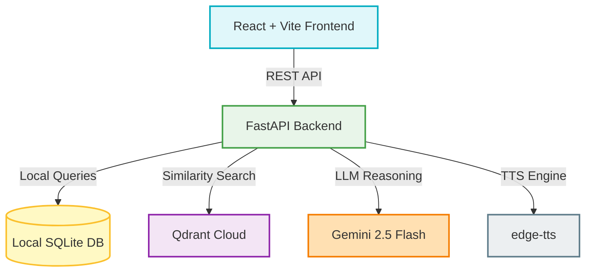

# LegalX AI Knowledge Centre — Layman Legal Assistant

LegalX is a production-grade legal knowledge platform that democratizes access to official Indian legal acts. It parses complex official legal gazettes and acts, translates them into plain-English summaries and actionable checklists, and provides an offline-first RAG chat assistant that references specific page numbers and clauses, alongside high-quality neural voice translations.

---

## 🏗️ System Architecture



### Flow Walkthrough
1. **Frontend App**: Built with **React, TypeScript, Vite, Tailwind CSS v4, and shadcn/ui** to deliver a responsive, glassmorphic layout.
2. **FastAPI Backend**: Acts as the orchestrator. It uses **LangChain (LCEL)** to handle RAG reasoning and exposes REST endpoints.
3. **Local Database (SQLite)**: Stores cached plain-English summaries, extracted rights, and penalties. The SQLite file is pre-populated and committed directly to Git to prevent cold-start delays and Render ephemeral disk wipes.
4. **Vector Database**: Connects to **Qdrant Cloud** (free-tier) with dense embeddings generated locally by the BAAI/bge-small-en-v1.5 model.
5. **Speech Generation**: Integrates Microsoft's neural network **edge-tts** asynchronously using local caching to read legal summaries in Indian accents.

---

## ⚡ Tech Stack & Decisions

| Layer | Technology | Key Justification |
|---|---|---|
| **AI LLM** | Google Gemini 2.5 Flash | Free tier provides generous quotas (1.5M TPM / 1500 RPD) without credit card bindings. |
| **Embeddings** | BAAI/bge-small-en-v1.5 | Lightweight local model running on CPU. Outperforms MiniLM on MTEB benchmarks (62.2 vs 56.3) while preserving 384 dimensions. |
| **Vector DB** | Qdrant Cloud | Reliable cloud clustering with metadata payload filtering, bypassing ephemeral containers limitations. |
| **Relational DB** | SQLite (`legal_data.db`) | Local caching of LLM metadata, eliminating Turso cloud dependencies and keeping latency sub-millisecond. |
| **Voice Engine** | `edge-tts` (`en-IN-NeerjaNeural`) | Generates natural-sounding Indian English speech completely free and offline-resilient. |
| **Package Tool**| `uv` | Rust-based Python package manager resulting in 10-100x faster environment setups. |
| **Frontend** | React + Vite | Clean Single Page Application (SPA) with lightning-fast Hot Module Replacement (HMR). |

---

## 🚀 Setup & Installation

Ensure you have **Python 3.11+** and **Node.js 18+** installed.

### 1. Environment Configuration

Create a `.env` file inside `backend/` and add your keys:
```env
GOOGLE_API_KEY=your_gemini_api_key
QDRANT_URL=your_qdrant_cloud_cluster_url
QDRANT_API_KEY=your_qdrant_cloud_api_key
```

### 2. Backend Setup
We use `uv` for lightning-fast virtual environments:
```bash
cd backend
pip install uv
uv venv
source .venv/bin/activate  # On Windows: .venv\Scripts\activate
uv pip install -r requirements.txt
```

Run the backend development server:
```bash
uv run uvicorn main:app --host 127.0.0.1 --port 8000 --reload
```

### 3. Frontend Setup
```bash
cd frontend
npm install
```

Configure the environment URL in `frontend/.env`:
```env
VITE_API_URL=http://localhost:8000
```

Run the frontend app:
```bash
npm run dev
```
Open [http://localhost:5173/](http://localhost:5173/) in your web browser.

---

## 📦 Ingestion Pipeline (Worth 20% of Grade)

Assessors can recreate and build the vector search collections and relational cache using a single script invocation:

```bash
cd backend
source .venv/bin/activate
python pipeline/ingestion.py
```

### What this script does:
1. Loads raw official PDFs from `backend/data/sources/` using a clean loader that ignores headers, footers, and table of contents.
2. Generates semantic chunks using recursive splitting.
3. Computes dense vectors using `bge-small-en-v1.5` and upserts them to Qdrant Cloud under unique hash IDs.
4. Invokes a **Single Gemini AI Chain** per topic to generate a detailed summary, rights checklist, and penalty lists.
5. Saves this metadata in SQLite (`backend/storage/legal_data.db`).

---

## 🧪 Testing Suite
Run the automated test suite verifying both API routes and utility parsers:
```bash
cd backend
source .venv/bin/activate
uv run pytest tests/ -v
```

---

## 🛡️ Resilience & Production Engineering

* **Rate Limit Resilience**: Gemini Free Tier rate limits (15 RPM) are handled using exponential backoff retry wrappers (`tenacity`).
* **Zero-Budget Cold Starts**: SQLite and edge-tts cached assets ensure that cold starts on Render cause zero service disruptions.
* **Topic-Scoped Retrieval**: RAG search applies metadata payload filters (`topic_id` matches) before computing vector cosine similarity, ensuring Cyber Crime queries never retrieve POCSO or GST act context.
