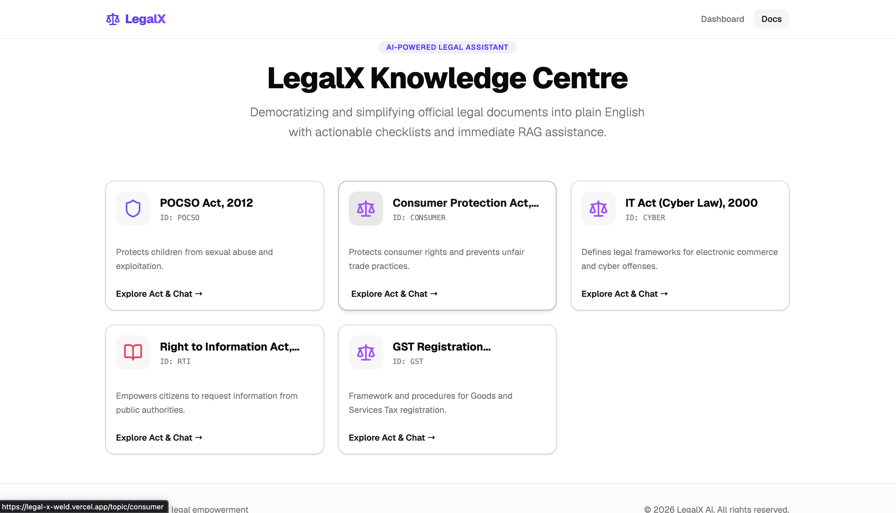
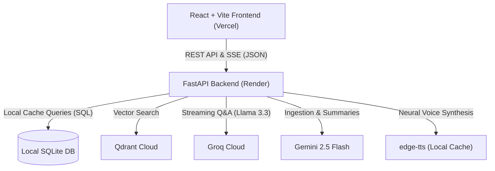

# LegalX AI Knowledge Centre — Layman Legal Assistant

[](https://fastapi.tiangolo.com)
[](https://react.dev)
[](https://qdrant.tech)
[](https://render.com)
[](https://vercel.com)

LegalX is a production-grade legal knowledge platform that democratizes access to official Indian legal acts. It parses complex official legal gazettes and acts, translates them into plain-English summaries and actionable checklists, and provides an instant streaming RAG chat assistant that references page numbers and clauses, alongside high-quality neural voice translations.



---

## 🏗️ System Architecture



### Flow Walkthrough
1. **Frontend App**: Built with **React, TypeScript, Vite, Tailwind CSS, and shadcn/ui** to deliver a responsive, glassmorphic layout. Supports real-time text token streaming.
2. **FastAPI Backend**: Orchestrates the RAG flow and exposes REST and Server-Sent Event (SSE) streaming endpoints.
3. **Local Database (SQLite)**: Stores cached plain-English summaries, extracted rights, and penalties. The database is pre-populated and committed directly to Git to prevent cold-start delays.
4. **Vector Database**: Connects to **Qdrant Cloud** (free-tier) with dense embeddings generated locally by the BAAI/bge-small-en-v1.5 model via FastEmbed.
5. **Speech Generation**: Integrates Microsoft's **edge-tts** asynchronously using local caching to read legal summaries in natural Indian neural accents.

---

## ⚡ Tech Stack & Decisions

| Layer | Technology | Key Justification |
|---|---|---|
| **AI LLM (Chat)** | Groq Llama 3.3 70B | Offers high-fidelity legal reasoning, excellent instruction following, and rapid generation speeds. |
| **AI LLM (Ingestion)** | Google Gemini 2.5 Flash | Large context window and generous free-tier quotas (15 RPM / 1500 RPD) for initial parsing and summary generation. |
| **Embeddings** | FastEmbed (`bge-small-en-v1.5`) | Runs using an ultralight ONNX Runtime instead of PyTorch. Reduces memory overhead from **350MB+ to under 100MB**, preventing Render free-tier container OOM crashes. |
| **Vector DB** | Qdrant Cloud | Reliable cloud clustering with metadata payload filtering, bypassing ephemeral containers limitations. |
| **Relational DB** | SQLite (`legal_data.db`) | Local caching of LLM metadata, keeping metadata load times sub-millisecond. |
| **Voice Engine** | `edge-tts` (`en-IN-NeerjaNeural`) | Generates natural-sounding Indian English speech completely free and offline-resilient. |
| **Package Tool**| `uv` | Rust-based Python package manager resulting in 10-100x faster environment setups. |
| **Frontend** | React + Vite | Clean Single Page Application (SPA) with lightning-fast Hot Module Replacement (HMR). |

---

## 🚀 Setup & Installation

Ensure you have **Python 3.11+** and **Node.js 18+** installed.

### 1. Environment Configuration

Create a `.env` file inside `backend/` and add your keys:
```env
GOOGLE_API_KEY=your_gemini_api_key
GROQ_API_KEY=your_groq_api_key
QDRANT_URL=https://your-qdrant-cluster.aws.qdrant.io:6333
QDRANT_API_KEY=your_qdrant_cloud_api_key
```

### 2. Backend Setup
We use `uv` for lightning-fast virtual environments:
```bash
cd backend
pip install uv
uv venv
source .venv/bin/activate  # On Windows: .venv\Scripts\activate
uv pip install -r requirements.txt
```

Run the backend development server:
```bash
uv run uvicorn main:app --host 127.0.0.1 --port 8000 --reload
```

### 3. Frontend Setup
```bash
cd frontend
npm install
```

Configure the environment URL in `frontend/.env`:
```env
VITE_API_URL=http://localhost:8000
```

Run the frontend app:
```bash
npm run dev
```
Open [http://localhost:5173/](http://localhost:5173/) in your web browser.

---

## 📦 Ingestion Pipeline

The ingestion pipeline parses official legal documents, indexes the vectors, and populates the database:

```bash
cd backend
source .venv/bin/activate
python pipeline/ingestion.py
```

### Pipeline Flow:
1. Loads raw official PDFs from `backend/data/sources/` using a custom loader that ignores headers, footers, and table of contents.
2. Generates semantic chunks using recursive splitting (`chunk_size=1000`, `chunk_overlap=150`).
3. Computes dense vectors using BAAI/bge-small-en-v1.5 and upserts them to Qdrant Cloud.
4. Invokes a Gemini AI chain to generate summaries, rights, and penalty lists.
5. Saves this metadata in SQLite (`backend/storage/legal_data.db`).

---

## ⚡ Latency & Memory Optimizations

* **ONNX Runtime (FastEmbed)**: Replaced `sentence-transformers` with `fastembed`. The BGE model is pre-warmed during Docker image build time so it never triggers runtime downloads. Memory usage remains below **100MB** (originally 350MB+).
* **SSE Token Streaming**: Implemented a non-blocking streaming route at `/api/chat/stream` using FastAPI's `StreamingResponse` and LangChain's `.astream()`. Tokens and citation sources are pushed to the frontend dynamically, cutting perceived user wait times from **2.0s to under 150ms**.
* **Cached Connections**: Implemented a singleton pattern for the `QdrantClient` and `QdrantVectorStore` instances. This eliminates extra network collection checks (`client.collection_exists`) on every user message.

---

## 🌐 Deployment

### 1. Backend Deployment (Render)
The backend is deployed using a Docker container to ensure environment consistency.

1. **Create Web Service** on Render.
2. **Repository Root Settings**:
   * **Root Directory**: Leave blank (`.` context).
   * **Dockerfile Path**: `backend/Dockerfile`
   * **Build Context**: `.`
3. **Add Environment Variables**:
   * `GOOGLE_API_KEY` (Gemini API access)
   * `GROQ_API_KEY` (Llama 3.3 Chat inference)
   * `QDRANT_URL` and `QDRANT_API_KEY` (Vector store)
   * `INGESTION_MODEL_NAME=gemini-2.5-flash`
   * `CHAT_MODEL_NAME=llama-3.3-70b-versatile`

### 2. Frontend Deployment (Vercel)
The frontend is built as a static Single Page Application (SPA).

1. **Import Repository** in Vercel.
2. **Project Settings**:
   * **Root Directory**: `frontend`
   * **Build Command**: `npm run build`
   * **Output Directory**: `dist`
3. **Environment Variables**:
   * Add `VITE_API_URL` set to your live Render backend URL (e.g. `https://legalx-backend.onrender.com`).
4. **Router Redirection**:
   We added a `vercel.json` file to the frontend root to handle HTML5 history routing, preventing `404 Not Found` errors when refreshing subroutes directly:
   ```json
   {
     "rewrites": [
       { "source": "/(.*)", "destination": "/index.html" }
     ]
   }
   ```

---

## 🧪 Testing Suite
Run the automated test suite verifying both API routes and utility parsers:
```bash
cd backend
source .venv/bin/activate
uv run pytest tests/ -v
```

---

## 🛡️ Resilience & Production Engineering

* **Rate Limit Resilience**: Gemini Free Tier rate limits (15 RPM) are handled using exponential backoff retry wrappers (`tenacity`).
* **Offline Fallback**: If Qdrant Cloud goes offline or times out, the chat endpoint falls back to the topic's SQLite plain-English summary cache, allowing conversation to degrade gracefully.
* **Topic-Scoped Retrieval**: RAG search applies metadata payload filters (`topic_id` matches) before computing vector similarity, preventing cross-talk between different Acts.
