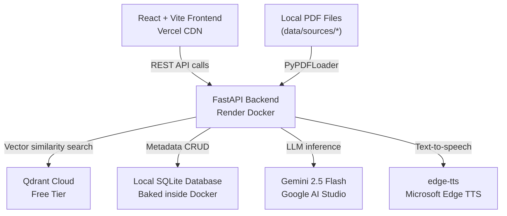

# LegalX AI Knowledge Centre — Production Engineering Blueprint

> This document is the single source of truth for building the LegalX AI Knowledge Centre. It contains zero boilerplate code. Every section explains **what** a component is, **why** it exists, **how it works conceptually**, and **where to learn more**. A junior developer reading this end-to-end should be able to build the system without guesswork.

---

## Table of Contents

| #  | Section                                          | Phase    |
|----|--------------------------------------------------|----------|
| 1  | [Read the Assessment Like an Engineer](#1-read-the-assessment-like-an-engineer) | Planning |
| 2  | [High-Level System Design](#2-high-level-system-design) | Planning |
| 3  | [Technology Stack — Every Decision Justified](#3-technology-stack--every-decision-justified) | Planning |
| 4  | [Repository & Project Structure](#4-repository--project-structure) | Planning |
| 5  | Phase 1 — Environment, Configuration & Docker    | Build    |
| 6  | Phase 2 — Data Ingestion & the Document Pipeline | Build    |
| 7  | Phase 3 — Embeddings, Chunking & the Vector Store| Build    |
| 8  | Phase 4 — LangChain Orchestration & AI Chains    | Build    |
| 9  | Phase 5 — FastAPI Backend                        | Build    |
| 10 | Phase 6 — React Frontend                        | Build    |
| 11 | Phase 7 — Audio Feature                         | Build    |
| 12 | Phase 8 — Resilience & Error Handling            | Harden   |
| 13 | Phase 9 — Testing                               | Harden   |
| 14 | Phase 10 — Bonus Features                       | Polish   |
| 15 | Phase 11 — Deployment                           | Ship     |
| 16 | Phase 12 — Documentation & Submission            | Ship     |
| 17 | [48-Hour Execution Timeline](#17-48-hour-execution-timeline) | Meta |
| 18 | [Reference Library](#18-reference-library)       | Meta     |

---

## 1. Read the Assessment Like an Engineer

Before writing a single line of code, read the assessment brief three times. Highlight every verb — *"build"*, *"extract"*, *"summarise"*, *"deploy"*. Each verb maps directly to a component you must implement. Here is how assessors allocate marks:

### 1.1 Scoring Breakdown

| Criterion               | Weight | What Assessors Actually Look For                                                                 |
|--------------------------|--------|--------------------------------------------------------------------------------------------------|
| **Automation Pipeline**  | 20%    | One command (`python scripts/ingest_all.py`) fetches URLs, cleans HTML, chunks text, embeds, stores in Qdrant, generates summaries, and writes metadata to local SQLite. No manual steps. |
| **AI Legal Assistant**   | 20%    | A RAG-powered chatbot that retrieves relevant chunks from Qdrant, sends them to Gemini 2.5 Flash with a legal-assistant system prompt, and returns grounded answers with source citations. |
| **Summary Quality**      | 15%    | LLM-generated summaries that are accurate, well-structured (bullet points, headings), and demonstrate prompt engineering skill — not raw copy-paste from the source page.              |
| **Info Extraction**      | 10%    | Structured extraction of key entities: legislation names, regulatory bodies, important dates, penalties, and compliance requirements — returned as JSON, displayed as cards/tables.      |
| **Audio Feature**        | 10%    | Text-to-speech playback of summaries using neural voices. Must sound professional, not robotic. Streaming or on-demand generation, with a visible play/pause UI control.                |
| **Code Quality**         | 15%    | Clean separation of concerns, type hints, docstrings, meaningful variable names, no 2000-line monolith files. Tests exist and pass. Docker works.                                     |
| **Documentation**        | 10%    | README with setup instructions, architecture explanation, `.env.example`, and a brief write-up of design decisions. Someone else can clone and run it.                                 |

### 1.2 Key Strategic Insight

> **The assessors want to see LangChain chains and RAG — not raw API calls.**

If you call `google.generativeai.generate_content()` directly everywhere, you will lose marks even if the output is identical. Why? Because the assessment tests whether you understand **orchestration frameworks**. LangChain's LCEL (LangChain Expression Language) lets you compose prompts, models, parsers, and retrievers into declarative pipelines. That composability is the point.

Every LLM interaction in this project goes through a LangChain chain:
- Summary generation → `summary_chain.py`
- Key info extraction → `extraction_chain.py`
- Flashcard generation → `card_chain.py`
- RAG Q&A → `rag_chain.py`

### 1.3 What "Automation" Really Means

The word "automation" in the brief does not mean a cron job or a CI pipeline. It means:

```
$ python scripts/ingest_all.py
```

That single command must:
1. Read a list of topic URLs (hardcoded or from a config file)
2. Fetch each URL's HTML content asynchronously
3. Clean the HTML → extract plain text
4. Split text into overlapping chunks
5. Embed each chunk using the local embedding model
6. Upsert vectors + metadata into Qdrant Cloud
7. Generate an LLM summary, key info extraction, and flashcards for each topic
8. Store all generated content in local SQLite database (committed to Git, baked into Docker image)
9. Print a progress report to stdout

If an assessor clones your repo, sets three environment variables, and runs that script — the entire knowledge base should be populated in under 5 minutes.

---

## 2. High-Level System Design

### 2.1 Architecture Overview

```
┌──────────────────────────────────────────────────────────┐
│                   USER (Browser)                         │
└─────────────────────────┬────────────────────────────────┘
                          │ HTTPS
                          ▼
┌──────────────────────────────────────────────────────────┐
│           React + Vite Frontend (Vercel)                 │
│                                                          │
│   Pages: HomePage  |  TopicPage  |  ChatPage             │
│   Components: TopicCard, ChatInterface, AudioPlayer      │
│   State: React Query (TanStack) for server cache         │
└─────────────────────────┬────────────────────────────────┘
                          │ REST API (JSON)
                          ▼
┌──────────────────────────────────────────────────────────┐
│          FastAPI Backend (Render — Docker)                │
│                                                          │
│   Routes: /topics  /topics/{id}  /chat  /audio/{id}      │
│   Chains: summary_chain | extraction_chain | rag_chain   │
│   Pipeline: loader → splitter → embedder → store         │
└──────┬──────────────┬──────────────┬─────────────────────┘
       │              │              │
       ▼              ▼              ▼
┌────────────┐ ┌────────────┐ ┌────────────────┐
│  Qdrant    │ │   Local    │ │   edge-tts     │
│  Cloud     │ │   SQLite   │ │  (on-demand)   │
│            │ │ (git/image)│ │                │
│ Vectors +  │ │ Summaries, │ │ Neural TTS,    │
│ Chunks +   │ │ Key Info,  │ │ 400+ voices,   │
│ Metadata   │ │ Flashcards │ │ no API key     │
└────────────┘ └────────────┘ └────────────────┘
                     │
                     ▼
          ┌────────────────────┐
          │  Google Gemini     │
          │  2.5 Flash (API)   │
          │                    │
          │  Summaries, Q&A,   │
          │  Extraction        │
          └────────────────────┘
```

### 2.2 Why Two Separate Applications?

Many tutorials use Streamlit to build a single-file AI demo. We do **not** use Streamlit. Here is why:

| Concern              | Streamlit                        | FastAPI + React                          |
|----------------------|----------------------------------|------------------------------------------|
| Deployment           | Single process, single host      | Independent scaling, independent deploys |
| Frontend control     | Widget-based, limited CSS        | Full control, custom UI, animations      |
| API reuse            | No API — logic is in widgets     | REST API usable by mobile, CLI, tests    |
| Production thinking  | Prototype-grade                  | Production-grade architecture            |
| Assessor impression  | "Student project"                | "Engineer who understands separation"    |

Splitting into a backend API and a frontend client is a **production pattern**. The assessor can test your API with `curl` independently of the UI. That alone demonstrates engineering maturity.

### 2.3 Subsystem 1: The Ingestion Pipeline

This subsystem runs **once** (or on-demand) to build the knowledge base. It has no user-facing UI — it is a script.

```
Local Gov PDF (e.g., AA2012-32.pdf)
    │
    ▼
PyPDFLoader ──► Page Documents (with local metadata)
    │
    ▼
RecursiveCharacterTextSplitter ──► Overlapping Chunks (800 chars, 200 overlap)
    │
    ▼
BAAI/bge-small-en-v1.5 ──► 384-dim Vectors
    │
    ├──► Qdrant Cloud (vectors + chunk text + metadata)
    │
    ▼
Gemini 2.5 Flash (via LangChain chains)
    │
    ├──► Plain English Summary (markdown)
    ├──► Key Info Cards & Checklists (markdown)
    └──► Flashcards (JSON array of Q&A pairs)
          │
          ▼
      Local SQLite Database (cache all generated content, committed to Git)
```

**Why cache in a local SQLite file committed to Git?** Because Gemini has rate limits (~10-15 RPM on the free tier). If your Render container restarts, you do not want to re-generate all summaries. By running ingestion locally, writing to a local `legal_data.db` file, committing it to Git, and building it directly into the Docker image, the database is loaded with the container. It is indestructible, has zero network latency, is 100% free, and survives Render container sleep/restart cycles without any cloud database dependency.

### 2.4 Subsystem 2: The RAG Q&A System

This subsystem runs **live** for every user question in the chat interface.

```
User Question: "What are the penalties under the IT Act?"
    │
    ▼
Embed the question ──► 384-dim vector (same model as ingestion)
    │
    ▼
Qdrant similarity search ──► Top-5 most relevant chunks
    │
    ▼
Build prompt:
    SYSTEM: "You are a legal research assistant..."
    CONTEXT: [chunk_1, chunk_2, ..., chunk_5]
    QUESTION: "What are the penalties under the IT Act?"
    │
    ▼
Gemini 2.5 Flash ──► Grounded answer with inline citations
    │
    ▼
Return to frontend:
    {
      "answer": "Under Section 43 of the IT Act...",
      "sources": [
        {"title": "IT Act Overview", "url": "https://..."}
      ]
    }
```

The critical word here is **grounded**. The LLM does not hallucinate an answer from its training data — it answers strictly from the retrieved chunks. The system prompt enforces this: *"If the context does not contain enough information, say so. Do not make up legal information."*

📚 **References**
- [RAG Explained (LangChain)](https://python.langchain.com/docs/concepts/rag/)
- [Retrieval-Augmented Generation (original paper)](https://arxiv.org/abs/2005.11401)

---

## 3. Technology Stack — Every Decision Justified

This section is your shopping list. Every technology was chosen for a specific reason. There are no "it depends" cop-outs — this blueprint is opinionated.

---

### 3.1 LLM: Google Gemini 2.5 Flash

**What it is.** Gemini 2.5 Flash is Google's latest fast-and-cheap large language model, accessed via API through Google AI Studio. It is a "thinking model" — it reasons step-by-step internally before responding, which improves accuracy on complex tasks like legal summarisation.

**Free tier limits (no credit card required):**

| Resource          | Limit              |
|-------------------|--------------------|
| Requests/minute   | ~10-15 RPM         |
| Requests/day      | ~1,500 RPD         |
| Tokens/minute     | 1,000,000 TPM      |
| Context window    | 1,048,576 tokens   |

These limits are generous enough for a knowledge base of 8–12 legal topics. The ingestion pipeline makes ~3-4 LLM calls per topic (summary + extraction + flashcards), totalling ~30-48 calls. Well within the daily limit.

**Why not alternatives:**

| Alternative       | Why Not                                                                 |
|-------------------|-------------------------------------------------------------------------|
| GPT-4o (OpenAI)   | Requires a credit card to get an API key. Disqualified for free-tier.  |
| Claude (Anthropic) | No free API tier. Console chat is free, but API access requires payment.|
| Gemini 1.5 Flash  | Scheduled for shutdown June 2026. Building on a deprecated model is engineering malpractice. |
| Open-source (Llama, Mistral) | Requires GPU or massive CPU RAM for inference. Not feasible on Render free tier. |

**Configuration guidance:**
- **Temperature: 0.1–0.3** for factual legal content. Lower temperature = more deterministic, less creative hallucination. Legal summaries demand precision, not creativity.
- **Model name:** `gemini-2.5-flash` (this is the string you pass to LangChain)

**LangChain integration:**

```python
# Conceptual — not boilerplate
from langchain_google_genai import ChatGoogleGenerativeAI

llm = ChatGoogleGenerativeAI(
    model="gemini-2.5-flash",
    temperature=0.2,
    google_api_key=settings.GEMINI_API_KEY,
)
```

The `langchain-google-genai` package wraps the Gemini API into LangChain's `BaseChatModel` interface, meaning you can pipe it with `|` into prompts, parsers, and retrievers — exactly like any other LLM in LangChain.

📚 **References**
- [Google AI Studio (get API key)](https://aistudio.google.com/)
- [Gemini API Documentation](https://ai.google.dev/gemini-api/docs)
- [LangChain + Google Generative AI](https://python.langchain.com/docs/integrations/chat/google_generative_ai/)

---

### 3.2 Embedding Model: BAAI/bge-small-en-v1.5 (Local, CPU)

**What it is.** An embedding model converts a piece of text into a fixed-length array of numbers (a "vector") that captures its semantic meaning. Two texts about the same topic will have vectors that are close together in vector space, even if they use different words. This is the foundation of semantic search.

**Why this specific model:**

| Property            | bge-small-en-v1.5         | all-MiniLM-L6-v2 (old default) |
|---------------------|---------------------------|---------------------------------|
| MTEB average score  | 62.2                      | 56.3                            |
| Dimensions          | 384                       | 384                             |
| Model size          | 133 MB                    | 80 MB                           |
| Release             | 2023                      | 2022                            |
| License             | MIT                       | Apache 2.0                      |
| Runs on CPU?        | ✅ Yes                    | ✅ Yes                          |

The bge-small model scores **6 points higher** on the MTEB retrieval benchmarks, meaning it finds more relevant chunks for a given question. For a RAG system, retrieval quality directly determines answer quality. 133 MB is trivially small — it downloads once and loads in seconds.

**Why not API-based embeddings (Gemini, OpenAI)?**
During ingestion, you embed hundreds of chunks. Each chunk would be an API call, eating into rate limits and adding network latency. A local model embeds all chunks in a tight loop with zero network calls, completing in seconds rather than minutes.

**How it works in practice:**
The model downloads automatically the first time `sentence-transformers` loads it. After that, it is cached locally. In Docker, the model is baked into the image during build so there is no download at runtime.

```python
# Conceptual
from langchain_community.embeddings import HuggingFaceEmbeddings

embeddings = HuggingFaceEmbeddings(
    model_name="BAAI/bge-small-en-v1.5",
    model_kwargs={"device": "cpu"},
    encode_kwargs={"normalize_embeddings": True},
)
```

Setting `normalize_embeddings=True` is important — it ensures all vectors have unit length, making cosine similarity equivalent to dot product (faster computation).

📚 **References**
- [BAAI/bge-small-en-v1.5 on HuggingFace](https://huggingface.co/BAAI/bge-small-en-v1.5)
- [Sentence Transformers Documentation](https://www.sbert.net/)
- [MTEB Leaderboard](https://huggingface.co/spaces/mteb/leaderboard)

---

### 3.3 Vector Store: Qdrant Cloud (Free Tier)

**What it is.** A vector database is a specialised database designed to store vectors and find the most similar ones to a query vector, fast. Think of it as a search engine that understands meaning, not just keywords.

**Why cloud, not local:**
Render (our backend host) uses **ephemeral disks**. Every time your container restarts — deploys, crashes, or wakes from sleep — the filesystem is wiped clean. If you store vectors locally (FAISS, local Qdrant), they vanish. Qdrant Cloud is an independent managed service. Your vectors survive regardless of what happens to the backend container.

**Free tier (no credit card):**

| Resource       | Limit            |
|----------------|------------------|
| Clusters       | 1                |
| Storage        | 1 GB             |
| Nodes          | 1                |
| Credit card    | ❌ Not required  |

1 GB is more than enough for 8–12 legal topics with ~500 chunks total. Each chunk stores a 384-dim float32 vector (1.5 KB) plus payload text (~2 KB). That is ~1.7 MB for 500 chunks. You could store 500× more before hitting the limit.

**Core concepts:**

| Qdrant Concept | Relational DB Equivalent | Description                                                |
|----------------|--------------------------|-------------------------------------------------------------|
| Collection     | Table                    | A named group of vectors with a defined dimension (384)     |
| Point          | Row                      | A single entry: unique ID + vector + JSON payload           |
| Payload        | Columns                  | Metadata attached to each point (topic, URL, chunk index)   |
| Payload filter | WHERE clause             | Filter search results by metadata before ranking by vector  |

**Payload filtering** is critical for this project. When a user asks a question in the context of a specific topic (e.g., "IT Act"), you filter the search to only chunks with `topic: "it-act"` before running similarity search. This prevents cross-topic contamination in answers.

**Why not alternatives:**

| Alternative  | Why Not                                                              |
|--------------|----------------------------------------------------------------------|
| FAISS        | In-memory only, no persistence, no metadata filtering, no cloud tier |
| ChromaDB     | Stores data on local disk — same ephemeral disk problem on Render    |
| Pinecone     | Free tier requires a credit card                                     |
| Weaviate     | Free cloud tier is more limited, heavier setup                       |

**LangChain integration:**

Use the `QdrantVectorStore` class from `langchain-qdrant`. Do **not** use the deprecated `Qdrant` class — it is removed in recent versions.

```python
# Conceptual
from langchain_qdrant import QdrantVectorStore
from qdrant_client import QdrantClient

client = QdrantClient(
    url=settings.QDRANT_URL,
    api_key=settings.QDRANT_API_KEY,
)

vector_store = QdrantVectorStore(
    client=client,
    collection_name="legal_chunks",
    embedding=embeddings,  # the bge-small model from §3.2
)

# Use as a retriever in RAG chains
retriever = vector_store.as_retriever(search_kwargs={"k": 5})
```

📚 **References**
- [Qdrant Cloud Signup (free)](https://cloud.qdrant.io/)
- [Qdrant Quickstart](https://qdrant.tech/documentation/quickstart/)
- [LangChain + Qdrant Integration](https://python.langchain.com/docs/integrations/vectorstores/qdrant/)
- [Qdrant Payload Filtering](https://qdrant.tech/documentation/concepts/filtering/)

---

### 3.4 AI Framework: LangChain (LCEL Only)

**What it is.** LangChain is a Python framework for building applications powered by LLMs. It provides pre-built integrations for models, vector stores, document loaders, text splitters, and output parsers — so you compose components instead of writing glue code from scratch.

**LCEL: The Only Way to Write Chains**

LangChain Expression Language (LCEL) is the modern, declarative syntax for building chains. It uses Python's `|` (pipe) operator to connect components:

```python
# Conceptual LCEL chain
chain = prompt | llm | StrOutputParser()
result = chain.invoke({"topic": "IT Act"})
```

Each component in the pipe implements a standard interface: it takes input, transforms it, and passes output to the next component. This is function composition — the same idea as Unix pipes (`cat file | grep "law" | sort`).

**What to use:**

| Component                    | Purpose                                      |
|------------------------------|----------------------------------------------|
| `ChatPromptTemplate`        | Build structured prompts with variables       |
| `RunnablePassthrough`       | Pass data through unchanged (for routing)     |
| `RunnableParallel`          | Run multiple chains simultaneously            |
| `StrOutputParser`           | Extract plain text from LLM response          |
| `JsonOutputParser`          | Parse LLM response as structured JSON         |
| `RunnableWithMessageHistory`| Add chat memory to a chain (per-session)      |
| `RecursiveCharacterTextSplitter` | Split documents into overlapping chunks  |

**What to NEVER use (deprecated legacy classes):**

| ❌ Deprecated               | ✅ Modern Replacement                         |
|-----------------------------|-----------------------------------------------|
| `LLMChain`                 | `prompt \| llm \| StrOutputParser()`          |
| `SequentialChain`           | `chain1 \| chain2` (just pipe them)           |
| `ConversationBufferWindowMemory` | `RunnableWithMessageHistory`            |
| `AgentExecutor`             | `langgraph` (not needed for this project)     |
| `load_qa_chain`             | Custom LCEL retrieval chain                   |

**Why LangChain, not raw API calls?**

You could call `google.generativeai.generate_content()` directly and parse the response yourself. But you would lose:
- **Automatic retries** with exponential backoff (via `.with_retry()`)
- **Structured output parsing** (JSON extraction with error recovery)
- **Qdrant integration** (retriever → prompt → LLM in one pipeline)
- **Consistent interface** — swap Gemini for any other model by changing one line
- **Assessor expectations** — the brief asks for LangChain. Give them LangChain.

📚 **References**
- [LCEL Documentation](https://python.langchain.com/docs/concepts/lcel/)
- [LangChain Core Concepts](https://python.langchain.com/docs/concepts/)
- [RAG Tutorial (LangChain)](https://python.langchain.com/docs/tutorials/rag/)

---

### 3.5 Backend: FastAPI

**What it is.** FastAPI is a modern Python web framework for building REST APIs. It uses Python type hints and Pydantic models to automatically validate request/response data, generate OpenAPI documentation, and provide editor autocompletion.

**Why FastAPI:**

| Feature               | FastAPI           | Flask              |
|------------------------|-------------------|--------------------|
| Request validation     | Automatic (Pydantic) | Manual            |
| Async support          | Native `async/await` | Requires extensions |
| Auto-generated docs    | `/docs` (Swagger UI) | None built-in     |
| Type hints             | Required & enforced | Optional           |
| Performance            | ASGI (fast)        | WSGI (slower)      |

**Why not Node.js/Express?** The entire AI pipeline — LangChain, sentence-transformers, Qdrant client, edge-tts — is Python. Building the API in Python means zero language boundaries. You import your chain and call `chain.invoke()` directly in a route handler.

FastAPI's `/docs` endpoint is a hidden superpower: assessors can open `https://your-api.onrender.com/docs` and test every endpoint interactively without touching the frontend. That is free marks for documentation.

📚 **References**
- [FastAPI Tutorial](https://fastapi.tiangolo.com/tutorial/)
- [FastAPI Async Support](https://fastapi.tiangolo.com/async/)

---

### 3.6 Frontend: React + Vite + Tailwind CSS + shadcn/ui

**Why Vite, not Next.js:**
Next.js is a full-stack React framework with server-side rendering (SSR), server components, API routes, and file-based routing. That is powerful — and completely unnecessary for this project. All our data comes from the FastAPI backend. We need a **client-side React app** that fetches JSON and renders it. Vite gives us:

| Property           | Vite                     | Next.js                           |
|--------------------|--------------------------|-----------------------------------|
| Setup time         | 30 seconds               | 2 minutes + config decisions      |
| Mental model       | Standard React SPA       | SSR + client + server components  |
| Build speed        | ~1 second HMR            | Slower (Webpack/Turbopack)        |
| Deployment         | Static files → Vercel    | Requires Node.js server or edge   |
| Learning curve     | You know React? You're done. | Must learn Next.js concepts    |

In a 48-hour sprint, every minute of yak-shaving costs you a feature. Vite eliminates an entire class of "why isn't my server component working?" debugging sessions.

**Why not Create React App?** It is officially deprecated by the React team. Do not use it.

**Tailwind CSS** is a utility-first CSS framework. Instead of writing `.card-header { font-size: 1.25rem; font-weight: 600; }` in a separate file, you write `className="text-xl font-semibold"` directly on the element. This is faster for prototyping and eliminates CSS naming debates during a sprint.

**shadcn/ui** is not a component library you install — it is a collection of beautifully designed, accessible components that you **copy into your project** and own. You run `npx shadcn@latest init`, then add individual components like `npx shadcn@latest add card button tabs`. They use Tailwind classes internally, so they integrate seamlessly.

Components you will use from shadcn/ui:
- `Card` — topic cards on the homepage
- `Tabs` — switch between Summary / Key Info / Flashcards on the topic page
- `Button` — actions, audio play/pause
- `Input` + `ScrollArea` — chat interface
- `Badge` — topic tags, legislation labels
- `Skeleton` — loading states while API calls resolve

📚 **References**
- [Vite Getting Started](https://vite.dev/guide/)
- [React Router v7](https://reactrouter.com/)
- [Tailwind CSS Documentation](https://tailwindcss.com/docs)
- [shadcn/ui](https://ui.shadcn.com/)

---

### 3.7 Audio: edge-tts

**What it is.** `edge-tts` is a Python library that uses Microsoft Edge's Read Aloud service to convert text to speech using neural voices. It produces natural, human-like audio — the same voices you hear when you click "Read Aloud" in the Edge browser.

**Key properties:**

| Property         | Value                                    |
|------------------|------------------------------------------|
| Cost             | Free, no API key                         |
| Voices           | 400+ neural voices, many languages       |
| Recommended voice| `en-IN-NeerjaNeural` (Indian English, female, professional) |
| Async-native     | ✅ Built on `asyncio`                    |
| Output format    | MP3 (streamable)                         |

**Why not alternatives:**

| Alternative     | Why Not                                                        |
|-----------------|----------------------------------------------------------------|
| gTTS            | Uses an unofficial Google Translate endpoint. Fragile, robotic-sounding, no async support, could break at any time. |
| OpenAI TTS      | Requires API key + credit card. Not free-tier compatible.     |
| ElevenLabs      | Requires API key + credit card for meaningful usage.          |
| pyttsx3         | Offline but uses system TTS engines — robotic on Linux/Docker.|

**How it works conceptually:**
You pass text to `edge-tts`, it sends the text to Microsoft's TTS service over a WebSocket, and streams back MP3 audio. The audio is generated **on-demand** — when a user clicks the play button for a summary, the backend calls edge-tts, generates the audio, and streams it to the frontend. There is no need to pre-generate and store audio files.

For longer summaries, you can optionally cache the generated audio bytes in memory (using an LRU cache) so that repeated plays of the same summary do not re-invoke the TTS service.

📚 **References**
- [edge-tts on GitHub](https://github.com/rany2/edge-tts)
- [edge-tts on PyPI](https://pypi.org/project/edge-tts/)

---

### 3.8 Relational Storage: Local SQLite (Pre-populated & Committed)

**What it is.** SQLite is a lightweight, serverless, self-contained SQL database engine. The entire database is stored as a single file on disk (typically `backend/storage/legal_data.db`).

**Why local SQLite over cloud databases like Turso?**
For static data (such as legal documents and pre-generated summaries), local SQLite is the gold standard for zero-budget production apps:
1. **Zero Cost**: Truly local, with no remote database host or cloud quota restrictions.
2. **Zero Latency**: Read queries return in microseconds since the database file is read locally from the container's memory/disk (no remote network roundtrips).
3. **High Security**: Since the data is public legislative summaries, committing the SQLite database to GitHub presents no leakage risk. Sensitive credentials are kept in the `.env` file and never pushed.

**But what about Render's Ephemeral File System?**
Render's free tier sleeps and recreates containers, wiping runtime filesystem edits. We solve this by making our database **read-only at runtime**:
* **Local Ingestion**: The ingestion pipeline (`scripts/ingest_all.py`) is run **locally on your machine** during development. It populates `backend/storage/legal_data.db` and pushes vectors to Qdrant Cloud.
* **Commit to Git**: The generated SQLite file `legal_data.db` is committed to Git and pushed to GitHub.
* **Baked into the Image**: When Render builds your container, the database file is copied directly into the Docker image. On startup, restart, or wakeup, the database is already present and fully populated.
* **Ephemeral Disk is Safe**: The container only reads from the database. Since no new data is written at runtime, Render's disk wiping behavior has zero effect on the database state.

**Python client:**

```python
import sqlite3

# Connect to the local SQLite database file
conn = sqlite3.connect("storage/legal_data.db")

# Create tables
conn.execute("""
    CREATE TABLE IF NOT EXISTS topics (
        id TEXT PRIMARY KEY,
        title TEXT NOT NULL,
        summary TEXT,
        key_info TEXT,
        flashcards TEXT,
        source_url TEXT,
        created_at TIMESTAMP DEFAULT CURRENT_TIMESTAMP
    )
""")
conn.commit()
```

📚 **References**
- [SQLite Official Site](https://www.sqlite.org/)
- [Python sqlite3 Module](https://docs.python.org/3/library/sqlite3.html)

------------------|------------------|
| Databases        | 100              |
| Total storage    | 5 GB             |
| Row reads/month  | 500 million      |
| Row writes/month | 50 million       |
| Credit card      | ❌ Not required  |

For a knowledge base with 8–12 topics, you will use less than 1 MB of storage and make fewer than 1,000 reads per demo session.

**Python client:**

```python
import sqlite3

# Connect to the local SQLite database file
conn = sqlite3.connect("storage/legal_data.db")

# Create tables
conn.execute("""
    CREATE TABLE IF NOT EXISTS topics (
        id TEXT PRIMARY KEY,
        title TEXT NOT NULL,
        summary TEXT,
        key_info TEXT,
        flashcards TEXT,
        source_url TEXT,
        created_at TIMESTAMP DEFAULT CURRENT_TIMESTAMP
    )
""")
conn.commit()
```

The standard library `sqlite3` module provides the SQL interface. Since the database is pre-populated locally and committed to Git, no runtime cloud credentials or libraries are needed.

📚 **References**
- [SQLite Official Site](https://www.sqlite.org/)
- [Python sqlite3 Module](https://docs.python.org/3/library/sqlite3.html)

---

### 3.9 Deployment: Render (Backend) + Vercel (Frontend)

**Why two separate hosts?**

The frontend is a static bundle of HTML, CSS, and JavaScript. It does not need a server — just a CDN. Vercel is the best free static host: global CDN, automatic HTTPS, deploy on `git push`, zero configuration for Vite projects.

The backend is a Python application that needs a runtime (Python 3.11+), system dependencies (for sentence-transformers), and environment variables. Render runs Docker containers, which gives us full control over the environment.

**Vercel (Frontend):**

| Property         | Value                          |
|------------------|--------------------------------|
| Cost             | Free for personal projects     |
| Deploy method    | `git push` or Vercel CLI       |
| Build command    | `npm run build`                |
| Output directory | `dist/`                        |
| HTTPS            | Automatic                      |
| CDN              | Global edge network            |

**Render (Backend):**

| Property         | Value                              |
|------------------|------------------------------------|
| Cost             | Free for Docker deployments        |
| Sleep behavior   | Sleeps after 15 min inactivity     |
| Cold start       | ~30 seconds                        |
| Ephemeral disk   | ⚠️ Wiped on restart (why we pre-populate and build SQLite into the image) |
| Docker support   | Full Dockerfile support            |

**The critical insight:** By pre-populating our SQLite database locally and committing the `.db` file to Git, the database is baked directly into the Docker image. Because it is read-only at runtime, Render's ephemeral filesystem has no effect on it. The dynamic search data is queried remotely from Qdrant Cloud, which handles RAG searches. Render can restart your container infinitely, and the database remains completely intact.

📚 **References**
- [Vercel: Deploy a Vite App](https://vercel.com/docs/frameworks/vite)
- [Render: Deploy a Docker Service](https://docs.render.com/docker)

---

## 4. Repository & Project Structure

### 4.1 The Directory Tree

```
legalx-knowledge-centre/
│
├── backend/
│   ├── api/
│   │   ├── __init__.py
│   │   ├── routes/
│   │   │   ├── __init__.py
│   │   │   ├── topics.py          # GET /topics, GET /topics/{id}
│   │   │   ├── chat.py            # POST /chat
│   │   │   ├── audio.py           # GET /audio/{topic_id}
│   │   │   └── ingest.py          # POST /ingest (trigger pipeline)
│   │   └── schemas.py             # Pydantic request/response models
│   │
│   ├── core/
│   │   ├── __init__.py
│   │   ├── config.py              # Pydantic Settings (env vars)
│   │   └── logging.py             # Structured logging setup
│   │
│   ├── pipeline/
│   │   ├── __init__.py
│   │   ├── loader.py              # PyPDFLoader (Loads official PDFs)
│   │   ├── splitter.py            # RecursiveCharacterTextSplitter config
│   │   └── ingestion.py           # Orchestrates: load → split → embed → store
│   │
│   ├── chains/
│   │   ├── __init__.py
│   │   ├── summary_chain.py       # LCEL chain for topic summaries
│   │   ├── extraction_chain.py    # LCEL chain for key info extraction
│   │   ├── card_chain.py          # LCEL chain for flashcard generation
│   │   └── rag_chain.py           # LCEL chain for RAG Q&A with retriever
│   │
│   ├── storage/
│   │   ├── __init__.py
│   │   ├── vector_store.py        # Qdrant Cloud connection + retriever
│   │   └── database.py            # Local SQLite connection + CRUD operations
│   │
│   ├── services/
│   │   ├── __init__.py
│   │   ├── topic_service.py       # Business logic for topic operations
│   │   └── audio_service.py       # edge-tts wrapper + optional caching
│   │
│   ├── tests/
│   │   ├── __init__.py
│   │   ├── conftest.py            # Shared fixtures (test client, mock LLM)
│   │   ├── test_chains.py         # Unit tests for each LCEL chain
│   │   ├── test_api.py            # Integration tests for API routes
│   │   └── test_pipeline.py       # Tests for the ingestion pipeline
│   │
│   ├── main.py                    # FastAPI app factory + CORS + lifespan
│   ├── requirements.txt           # Pinned Python dependencies
│   └── Dockerfile                 # Multi-stage Docker build
│
├── frontend/
│   ├── src/
│   │   ├── pages/
│   │   │   ├── HomePage.tsx       # Grid of TopicCards
│   │   │   └── TopicPage.tsx      # Tabs: Summary | Key Info | Flashcards | Chat
│   │   │
│   │   ├── components/
│   │   │   ├── TopicCard.tsx       # Card component for homepage grid
│   │   │   ├── KeyInfoSection.tsx  # Renders extracted legislation, bodies, dates
│   │   │   ├── ChatInterface.tsx   # Chat input + message bubbles + citations
│   │   │   ├── AudioPlayer.tsx     # Play/pause button + progress bar
│   │   │   └── SourceCitation.tsx  # Clickable source links under chat answers
│   │   │
│   │   ├── lib/
│   │   │   └── api.ts             # Axios/fetch wrapper for backend API calls
│   │   │
│   │   ├── App.tsx                # React Router setup
│   │   └── main.tsx               # Vite entry point
│   │
│   ├── .env                       # VITE_API_URL=http://localhost:8000
│   ├── package.json
│   ├── tailwind.config.ts
│   ├── tsconfig.json
│   └── vite.config.ts
│
├── scripts/
│   └── ingest_all.py              # CLI entry point: python scripts/ingest_all.py
│
├── docker-compose.yml             # Orchestrates backend (+ optional frontend)
├── .env.example                   # Template for required environment variables
├── .gitignore
└── README.md                      # Setup instructions, architecture, screenshots
```

### 4.2 Separation of Concerns

Every directory in this project has **one reason to change**. This is the Single Responsibility Principle applied at the directory level:

| Directory          | Responsibility                          | When It Changes                                      |
|--------------------|-----------------------------------------|------------------------------------------------------|
| `api/routes/`     | HTTP request handling                   | When you add/modify an endpoint                      |
| `api/schemas.py`  | Request/response data shapes            | When the API contract changes                        |
| `core/`           | App-wide configuration and utilities    | When you add a new env var or change logging format   |
| `pipeline/`       | Document ingestion (fetch → chunk)      | When you change how documents are loaded or split     |
| `chains/`         | LLM chains (prompts + models + parsers) | When you change a prompt or output format             |
| `storage/`        | Data persistence (Qdrant + SQLite)      | When you change how/where data is stored              |
| `services/`       | Business logic orchestration            | When you change what a feature does (not how it's stored or served) |
| `tests/`          | Test cases                              | When any of the above changes                        |

**Why this matters for a 48-hour sprint:** When something breaks (and it will), you know exactly which file to open. Chat not working? Check `chains/rag_chain.py`. API returning 422? Check `api/schemas.py`. Vectors not found? Check `storage/vector_store.py`. No grep-ing through a 2,000-line monolith.

### 4.3 Key Files Explained

**`core/config.py`** — This file uses Pydantic's `BaseSettings` class to load environment variables with type validation. If `GEMINI_API_KEY` is missing, the app crashes immediately at startup with a clear error — not 10 minutes into an API call.

**`pipeline/ingestion.py`** — The orchestrator. It imports the loader, splitter, embedding model, and chains, then runs the full pipeline for a list of URLs. This is what `scripts/ingest_all.py` calls.

**`chains/*.py`** — Each file exports exactly one LCEL chain. The chain is a composable unit: prompt template → LLM → output parser. No side effects, no database calls inside the chain. The chain takes input and returns structured output. The caller decides what to do with the output.

**`storage/database.py`** — All SQLite operations live here. Functions like `save_topic()`, `get_topic()`, `get_all_topics()`. No other file in the project knows how to talk to the database. If you change the database file path or configuration, only this file changes.

**`frontend/src/lib/api.ts`** — A thin wrapper around `fetch` (or Axios) that handles the base URL, error formatting, and TypeScript types. Every component calls functions from this file — never constructs URLs manually.

### 4.4 Files That Do NOT Exist

Notably absent from this structure:

- **`storage/legal_data.db` is committed** — The pre-populated local SQLite file is committed to Git and deployed inside the Docker image.
- **No `audio/` cache directory** — Audio is generated on-demand by edge-tts and streamed. No files are saved to disk.
- **No `next.config.js`** — The frontend is Vite, not Next.js.
- **No `.env` committed to git** — Only `.env.example` with placeholder values. Real secrets stay in Render/Vercel environment settings.

---

> **End of Part 1.** The next part covers Phases 1–4: Environment setup, Docker, the ingestion pipeline, embeddings, and LangChain chain construction.

---

## PHASE 1 — Environment, Configuration & Docker (Hours 0–3)

### 1.1 Why This Phase Exists

Every project that skips environment setup pays for it later: secrets leak into Git, teammates can't reproduce bugs, and "works on my machine" becomes the team motto. We spend three hours now to save thirty hours of debugging later.

### 1.2 Virtual Environment

A virtual environment is an isolated Python installation. Packages you install inside it don't pollute your system Python, and you can nuke the whole thing by deleting one folder.

```bash
# Install uv package manager (fast, Rust-based pip replacement)
curl -LsSf https://astral.sh/uv/install.sh | sh  # macOS/Linux
# On Windows, use: powershell -ExecutionPolicy ByPass -c "irm https://astral.sh/uv/install.ps1 | iex"

# Create a virtual environment using uv
uv venv                       # creates a .venv/ directory

# Activate the virtual environment
source .venv/bin/activate     # macOS / Linux
# On Windows: .venv\Scripts\activate

# Install dependencies using uv
uv pip install -r requirements.txt
```

> [!TIP]
> Name it `venv` (not `.venv`, not `env`). Every tutorial and tool assumes this name, so you'll never have to explain it.

### 1.3 Git Init & .gitignore

```bash
git init
```

Create `.gitignore` immediately — before your first commit. One accidental commit of `.env` means your API keys are in Git history forever.

```gitignore
# Secrets — NEVER commit
.env

# Python
__pycache__/
*.pyc
venv/
*.egg-info/
dist/

# Data artifacts (reproducible via ingestion script)
data/

# Node / Frontend
node_modules/
dist/

# IDE
.vscode/
.idea/

# OS
.DS_Store
```

**Why `data/` is gitignored:** Your ingestion pipeline regenerates all data from local official PDFs. Storing raw data chunks in Git is unnecessary, but the pre-populated SQLite `legal_data.db` is committed to act as the read-only deployment data cache.

### 1.4 Centralized Configuration with pydantic-settings

Hardcoding secrets is how breaches happen. Scattering `os.getenv()` calls across 20 files is how bugs happen. Instead, define every config value once in a single class that reads from `.env` automatically.

**What pydantic-settings does:** It creates a Python class where each field maps to an environment variable. It validates types, provides defaults, and raises clear errors if a required variable is missing — all at startup, not at 2 AM in production.

```python
# app/core/config.py
from pydantic_settings import BaseSettings

class Settings(BaseSettings):
    # LLM
    google_api_key: str
    llm_model_name: str = "gemini-2.5-flash"

    # Database (Local SQLite)
    sqlite_db_path: str = "storage/legal_data.db"

    # Vector Store (Qdrant Cloud)
    qdrant_url: str
    qdrant_api_key: str

    # App
    log_level: str = "INFO"

    model_config = {"env_file": ".env", "env_file_encoding": "utf-8"}

settings = Settings()  # singleton — import this everywhere
```

Every other file in the project does `from app.core.config import settings` and accesses `settings.google_api_key`. One source of truth, validated at startup.

### 1.5 The .env Files

**Backend `.env`** (never committed, lives in project root):

```env
GOOGLE_API_KEY=AIza...your-key-here
# SQLITE_DB_PATH is optional; defaults to storage/legal_data.db
QDRANT_URL=https://your-cluster-id.aws.cloud.qdrant.io:6333
QDRANT_API_KEY=your-qdrant-api-key
LLM_MODEL_NAME=gemini-2.5-flash
```

**Frontend `.env`** (in the `frontend/` directory):

```env
VITE_API_URL=http://localhost:8000
```

> [!WARNING]
> Vite exposes variables prefixed with `VITE_` to client-side code. Never put secrets in frontend env files — only public URLs. Access it in React with `import.meta.env.VITE_API_URL`.

### 1.6 Structured Logging

Python's built-in `logging` module is all you need. Configure it once at startup; every module gets a child logger automatically.

```python
# app/core/logging_config.py
import logging
import sys

def setup_logging(level: str = "INFO"):
    logging.basicConfig(
        level=getattr(logging, level.upper()),
        format="%(asctime)s | %(levelname)-8s | %(name)s | %(message)s",
        datefmt="%Y-%m-%d %H:%M:%S",
        stream=sys.stdout,
    )

# In any module:
logger = logging.getLogger(__name__)
logger.info("Embedding model loaded in %.2fs", elapsed)
```

**Example log output** (what you'll actually see in your terminal):

```
2026-06-13 17:10:03 | INFO     | app.services.embeddings | Loading BAAI/bge-small-en-v1.5...
2026-06-13 17:10:07 | INFO     | app.services.embeddings | Embedding model loaded in 3.84s
2026-06-13 17:10:07 | INFO     | app.main                | Application startup complete
2026-06-13 17:10:09 | WARNING  | app.chains.rag          | Qdrant returned 0 results for query="xyz"
2026-06-13 17:10:12 | ERROR    | app.api.routes          | LLM call failed: ResourceExhausted, retrying...
```

**Why structured logging over `print()`:** Logs have timestamps, severity levels, and module names. You can filter by level (`WARNING` in production), search by module, and pipe them to monitoring tools. `print()` gives you none of that.

### 1.7 Dockerfile — Created NOW, Not Later

Most tutorials treat Docker as a "bonus step." That's backwards. If you can't containerize your app in Phase 1, you'll discover incompatibilities in Phase 10 when it's too late. Build the container on day one.

```dockerfile
FROM python:3.11-slim

# Install uv (blazing-fast Rust package installer)
COPY --from=ghcr.io/astral-sh/uv:latest /uv /uvx /bin/

WORKDIR /app

# System dependencies (needed for some Python packages)
RUN apt-get update && \
    apt-get install -y --no-install-recommends build-essential && \
    rm -rf /var/lib/apt/lists/*

# Install Python dependencies FIRST (cache optimization)
COPY requirements.txt .
RUN uv pip install --system --no-cache -r requirements.txt

# Copy application code
COPY . .

# Pre-download the embedding model into the image
RUN python -c "from sentence_transformers import SentenceTransformer; SentenceTransformer('BAAI/bge-small-en-v1.5')"

EXPOSE 8000

CMD ["uvicorn", "main:app", "--host", "0.0.0.0", "--port", "8000"]
```

### 1.8 Docker Layer Caching — Why Requirements Come Before Code

Docker builds images in layers, top-to-bottom. **If a layer changes, every layer below it is rebuilt.** This is the single most important Docker concept for development speed.

```
Layer 1: FROM python:3.11-slim          ← rarely changes
Layer 2: COPY --from=ghcr.io/...        ← installs uv binary
Layer 3: COPY requirements.txt .        ← changes when you add a package
Layer 4: RUN uv pip install ...         ← rebuilt only if requirements.txt changed
Layer 5: COPY . .                       ← changes on EVERY code edit
Layer 6: RUN python -c "..."            ← rebuilt only if Layer 5 changes
```

If you did `COPY . .` before `uv pip install`, every single code change would trigger a full dependency install — adding minutes to every build. By copying `requirements.txt` first and using `uv`, dependency installation is cached and takes less than 2 seconds when cache misses occur.

### 1.9 docker-compose.yml for Local Development

```yaml
# docker-compose.yml
version: "3.8"

services:
  backend:
    build: .
    ports:
      - "8000:8000"
    env_file:
      - .env
    volumes:
      - .:/app          # live-reload: code changes reflect without rebuild
    command: uvicorn main:app --host 0.0.0.0 --port 8000 --reload
```

Run with `docker compose up --build`. The `--reload` flag watches for file changes and restarts the server — essential during development.

> [!NOTE]
> The Docker container only runs your FastAPI app and queries Qdrant Cloud. The SQLite database is local and packaged inside the container. This keeps the environment completely self-contained and simple.

### 1.10 Phase 1 Checklist

| Task | Verification |
|---|---|
| `venv` created and activated | `which python` points to `./venv/bin/python` |
| Git initialized with `.gitignore` | `git status` shows no `.env` or `venv/` |
| `Settings` class loads from `.env` | `python -c "from app.core.config import settings; print(settings.llm_model_name)"` |
| Logging configured | Log output appears with timestamps and levels |
| `docker build .` succeeds | Image builds without errors |
| `docker compose up` starts server | `curl http://localhost:8000` returns a response |

📚 **References:**
- [pydantic-settings docs](https://docs.pydantic.dev/latest/concepts/pydantic_settings/)
- [python-dotenv](https://pypi.org/project/python-dotenv/)
- [Python logging HOWTO](https://docs.python.org/3/howto/logging.html)
- [Docker getting started](https://docs.docker.com/get-started/)
- [Dockerfile best practices](https://docs.docker.com/build/building/best-practices/)

---

## PHASE 2 — Data Ingestion & the Document Pipeline (Hours 3–7)

### 2.1 Why This Phase Exists

An AI system is only as good as its data. Garbage in, garbage out. This phase builds the pipeline that turns raw official legislation PDFs into clean, chunked, embedded documents ready for retrieval. You'll run this pipeline locally once to populate your vector store and your local metadata database.

### 2.2 Defining Legal Sources

LegalX covers major Indian legislation using official Government of India Gazettes downloaded from India Code (`indiacode.nic.in`).

| Topic ID | Name | Source File |
|---|---|---|
| `pocso` | POCSO Act, 2012 | `data/sources/AA2012-32.pdf` |
| `rti` | Right to Information Act, 2005 | `data/sources/RTI_Act_2005.pdf` |
| `consumer` | Consumer Protection Act, 2019 | `data/sources/Consumer_Protection_Act_2019.pdf` |

### 2.3 Why PDF Over HTML or Wikipedia

* **Authoritative Text**: Official Gazettes are the absolute legal authority. Wikipedia summaries can be altered by anyone and lack the exact, verbatim text of individual sections needed for legal precision.
* **Format Stability**: Public government websites are notorious for changing their DOM layouts, breaking web scrapers. Local PDFs are static and immune to network outages.
* **Offline Processing**: Ingestion works completely offline on the developer's machine, eliminating rate-limiting, CAPTCHAs, or scraper blocks.

### 2.4 The Source Map

Define your sources as a Python dictionary. This maps `topic_id` directly to local file paths:

```python
# app/data/sources.py
LEGAL_SOURCES = {
    "pocso": {
        "name": "POCSO Act, 2012",
        "description": "Protects children from sexual abuse and exploitation.",
        "filepath": "data/sources/AA2012-32.pdf",
    },
    "rti": {
        "name": "Right to Information Act, 2005",
        "description": "Empowers citizens to request information from public authorities.",
        "filepath": "data/sources/RTI_Act_2005.pdf",
    },
    # ... remaining topics
}
```

Every downstream component references `topic_id` from this map. Add a new law by placing the PDF in the sources folder and adding one dictionary entry.

### 2.5 Document Loading with PyPDFLoader

Instead of scraping unstable external website HTML, we load the official, government-issued PDF acts (like `AA2012-32.pdf` downloaded from indiacode.nic.in) directly from the local disk. This guarantees 100% legal accuracy and eliminates network dependencies during ingestion.

```python
from langchain_community.document_loaders import PyPDFLoader
import os

pdf_path = "data/sources/AA2012-32.pdf"

# Load and parse the PDF pages
loader = PyPDFLoader(pdf_path)
pages = loader.load()  # Returns List[Document], one per PDF page
```

**Why PyPDFLoader for Local PDFs?**
1. **Authoritative Sources**: The PDFs issued by the Ministry of Law and Justice contain exact spelling, commas, and formatting of clauses.
2. **Offline Resilience**: Ingestion runs 100% locally on your machine without requiring a scraper, eliminating rate-limits, Captchas, or network failures.
3. **Structured Metadata**: Each page document automatically retains metadata like `page` number and `source` file path, which can be passed to Qdrant for source citation lookup.

### 2.6 Text Splitting with RecursiveCharacterTextSplitter

An LLM can't process a 50,000-character Act in one go, and even if it could, embedding the whole thing into a single vector would lose all granularity. You need to split documents into chunks — small enough to be precise, large enough to be meaningful.

```python
from langchain_text_splitters import RecursiveCharacterTextSplitter

splitter = RecursiveCharacterTextSplitter(
    chunk_size=1000,       # target chars per chunk
    chunk_overlap=150,     # chars shared between consecutive chunks
    separators=["\n\n", "\n", ". ", " ", ""],
)
chunks = splitter.split_documents(clean_docs)
```

**How recursive splitting works:** The splitter tries to split on `\n\n` (paragraph breaks) first. If chunks are still too large, it falls back to `\n` (line breaks), then `. ` (sentences), then ` ` (words), and finally individual characters. This preserves natural text boundaries — paragraphs stay together when possible.

**Why 800–1200 chars?** Legal text is dense. Smaller chunks (200–400) lose context — "the penalty under this section" without knowing which section. Larger chunks (2000+) dilute the embedding — a chunk about both penalties AND filing procedures matches both queries poorly instead of one query well.

**Why overlap matters — visual example:**

```
Without overlap (chunk_overlap=0):
  Chunk 1: "...the complainant must file within 30 days"
  Chunk 2: "of receiving the order. Appeals may be filed..."

With overlap (chunk_overlap=150):
  Chunk 1: "...the complainant must file within 30 days of receiving the order."
  Chunk 2: "...file within 30 days of receiving the order. Appeals may be filed..."
```

Without overlap, the sentence about the 30-day deadline is split across two chunks. Neither chunk alone makes sense. With overlap, both chunks contain the complete sentence. The retriever can find it regardless of which chunk matches the query.

### 2.7 The Ingestion Orchestrator

The orchestrator ties everything together into one runnable script. It does three things:

```
┌─────────────────────────────────────────────────────┐
│              Ingestion Orchestrator                  │
│                                                      │
│  1. EMBED + STORE                                    │
│     chunks → bge-small-en-v1.5 → Qdrant Cloud       │
│     (with topic_id in payload metadata)              │
│                                                      │
│  2. GENERATE via LLM                                 │
│     full text → Gemini 2.5 Flash → summaries,        │
│     key info, card descriptions                      │
│                                                      │
│  3. CACHE in SQLite                                  │
│     generated content → local SQLite DB file         │
│     (avoids re-calling LLM on every page visit)      │
└─────────────────────────────────────────────────────┘
```

**Why cache generated content in local SQLite?**

Without caching, every time a user visits the RTI Act page, you'd call Gemini to regenerate the summary. That's:
- **Slow:** 2–5 seconds per LLM call, multiplied by every page visit
- **Expensive:** Burns through your free-tier rate limits
- **Wasteful:** The summary for a given law doesn't change between visits

With SQLite caching, the summary is generated once during ingestion on the local machine and served as a sub-millisecond database read thereafter. The populated database is committed to Git and baked directly into the Docker image, so it persists across Render container restarts without needing external cloud database queries.

**Idempotency — running the pipeline twice produces the same result:**

| Technique | How It Works |
|---|---|
| Deterministic point IDs | Hash the chunk content to generate Qdrant point IDs. Same content → same ID → upsert overwrites, no duplicates |
| Qdrant upsert | `upsert` creates or updates. Running twice doesn't create duplicate vectors |
| SQLite `INSERT OR REPLACE` | If a row for `topic_id="rti"` exists, it's replaced, not duplicated |

This means you can re-run the ingestion pipeline during development without manually clearing your databases first. Idempotency is a production requirement, not a nice-to-have.

### 2.8 Phase 2 Checklist

| Task | Verification |
|---|---|
| Source map defined | `len(LEGAL_SOURCES)` returns your topic count |
| PyPDFLoader parses local PDFs | Raw docs contain `<html>` tags |
| Html2TextTransformer cleans text | Clean docs contain readable paragraphs, no HTML |
| `topic_id` in every chunk's metadata | `all(c.metadata.get("topic_id") for c in chunks)` is `True` |
| Chunks are 800–1200 chars | `statistics.mean(len(c.page_content) for c in chunks)` ≈ 1000 |
| Ingestion script runs end-to-end | Qdrant collection has points, SQLite has rows |

📚 **References:**
- [PyPDFLoader docs](https://python.langchain.com/docs/how_to/pdf/)
- [Html2TextTransformer](https://python.langchain.com/docs/integrations/document_transformers/html2text)
- [LangChain text splitters](https://python.langchain.com/docs/concepts/text_splitters/)
- [Chunking strategies (Pinecone guide)](https://www.pinecone.io/learn/chunking-strategies/)

---

## PHASE 3 — Embeddings, Chunking & the Vector Store (Hours 7–11)

### 3.1 What Embeddings Are (30-Second Version)

An embedding converts text into a list of numbers (a vector). Similar texts produce similar vectors. "What are my rights under RTI?" and "How to file an RTI request?" will have vectors pointing in nearly the same direction, even though they share few words. This is how semantic search works — it matches meaning, not keywords.

### 3.2 BAAI/bge-small-en-v1.5 — Your Embedding Model

| Property | Value |
|---|---|
| Dimensions | 384 |
| Model size | ~133 MB |
| License | MIT (fully free, commercial OK) |
| Runs on | CPU (no GPU needed) |
| Load time | 3–5 seconds cold start |
| Key flag | `normalize_embeddings=True` |

**Why this model?** It tops the MTEB leaderboard for its size class. It's small enough to run on a free-tier Render instance (512 MB RAM), fast enough to embed queries in real-time (<100ms per query), and the MIT license means zero legal risk.

**Why `normalize_embeddings=True`?** BGE models are trained with normalized vectors. Normalization scales every vector to length 1.0, which means cosine similarity reduces to a simple dot product — faster computation, consistent scores between 0 and 1.

### 3.3 Singleton Pattern — Load Once, Use Forever

The embedding model takes 3–5 seconds to load from disk. You must load it once at application startup and reuse the same instance for every request.

```python
# app/services/embeddings.py
from langchain_community.embeddings import HuggingFaceEmbeddings

_embedding_model = None

def get_embedding_model() -> HuggingFaceEmbeddings:
    global _embedding_model
    if _embedding_model is None:
        _embedding_model = HuggingFaceEmbeddings(
            model_name="BAAI/bge-small-en-v1.5",
            model_kwargs={"device": "cpu"},
            encode_kwargs={"normalize_embeddings": True},
        )
    return _embedding_model
```

> [!CAUTION]
> If you create a new `HuggingFaceEmbeddings()` instance in every request handler, you'll load 133 MB from disk on every API call. Response times will jump from 200ms to 5 seconds, and your container will eventually OOM from multiple copies in memory.

### 3.4 Qdrant Cloud Setup

Qdrant is a purpose-built vector database. It stores your embeddings and lets you search them by similarity — "find the 5 chunks most similar to this question."

**Setup steps:**

1. Go to [cloud.qdrant.io](https://cloud.qdrant.io) and create a free account (no credit card)
2. Create a cluster (free tier gives you 1 GB — plenty for ~10,000 legal chunks)
3. Copy your cluster URL and API key into `.env`

**Create the collection** (run once, e.g., in your ingestion script):

```python
from qdrant_client import QdrantClient
from qdrant_client.models import Distance, VectorParams

client = QdrantClient(url=settings.qdrant_url, api_key=settings.qdrant_api_key)

client.create_collection(
    collection_name="legal_docs",
    vectors_config=VectorParams(size=384, distance=Distance.COSINE),
)
```

**What a Qdrant "point" looks like** — each chunk becomes one point:

```json
{
  "id": "a3f8c2d1...",
  "vector": [0.023, -0.114, 0.087, "... 384 numbers total"],
  "payload": {
    "topic_id": "pocso",
    "source_url": "https://www.indiacode.nic.in/handle/123456789/1987",
    "chunk_text": "Section 4 of the POCSO Act prescribes...",
    "page_content": "Section 4 of the POCSO Act prescribes..."
  }
}
```

The `payload` is arbitrary metadata stored alongside the vector. It's searchable, filterable, and returned with results. This is where `topic_id` lives.

### 3.5 QdrantVectorStore — LangChain Integration

Connect LangChain to your Qdrant Cloud cluster:

```python
from langchain_qdrant import QdrantVectorStore
from qdrant_client import QdrantClient

client = QdrantClient(url=settings.qdrant_url, api_key=settings.qdrant_api_key)

vector_store = QdrantVectorStore(
    client=client,
    collection_name="legal_docs",
    embedding=get_embedding_model(),
)
```

> Use `QdrantVectorStore` from the `langchain-qdrant` package. The older `Qdrant` class from `langchain_community` is deprecated and will be removed. Install with `uv pip install langchain-qdrant`.

### 3.6 Payload Filtering — Scoping Search to a Topic

When a user asks about POCSO, you don't want to search all 10,000 chunks across every law. Payload filtering applies a hard filter **before** similarity scoring — Qdrant only considers chunks where `topic_id == "pocso"`.

```python
from qdrant_client.models import Filter, FieldCondition, MatchValue

topic_filter = Filter(
    must=[
        FieldCondition(
            key="metadata.topic_id",
            match=MatchValue(value="pocso"),
        )
    ]
)

results = vector_store.similarity_search(
    query="What are the penalties under POCSO?",
    k=5,
    filter=topic_filter,
)
```

**Why this matters for legal AI:** Without filtering, a query about "penalties" might return chunks from the Consumer Protection Act, IT Act, and POCSO Act mixed together. The LLM would then cite the wrong law's penalties — a dangerous hallucination in legal context. Filtering guarantees the context comes from the right legislation.

### 3.7 Retrieval Strategy — MMR over Pure Similarity

**Pure similarity search** returns the 5 chunks closest to the query vector. The problem? Legal documents often restate the same point in different sections. You might get 5 chunks that all say "the penalty is imprisonment up to 7 years" in slightly different words — maximum redundancy, zero breadth.

**Maximal Marginal Relevance (MMR)** solves this. It fetches 20 candidates by similarity, then iteratively selects 5 that are both relevant to the query AND diverse from each other.

```python
retriever = vector_store.as_retriever(
    search_type="mmr",
    search_kwargs={
        "k": 5,                    # final number of chunks returned
        "fetch_k": 20,             # candidates fetched before MMR filtering
        "lambda_mult": 0.7,        # 0=max diversity, 1=max relevance
        "filter": topic_filter,
    },
)
```

The `lambda_mult` parameter balances relevance vs. diversity. At 0.7, you're saying "relevance matters more, but still give me variety." For legal QA, this means you get the most relevant provisions AND related context (definitions, exceptions, procedures) instead of five paraphrases of the same provision.

### 3.8 Phase 3 Checklist

| Task | Verification |
|---|---|
| Qdrant Cloud cluster created | Dashboard shows the cluster as active |
| `legal_docs` collection exists | `client.get_collection("legal_docs")` returns config |
| Embedding model loads as singleton | Second call to `get_embedding_model()` is instant |
| Points have `topic_id` in payload | Query any point, check `payload.metadata.topic_id` |
| MMR retrieval returns diverse results | 5 results cover different sections, not paraphrases |

📚 **References:**
- [BGE-small-en-v1.5 on HuggingFace](https://huggingface.co/BAAI/bge-small-en-v1.5)
- [Qdrant Cloud signup](https://cloud.qdrant.io)
- [QdrantVectorStore docs](https://python.langchain.com/docs/integrations/vectorstores/qdrant/)
- [Qdrant payload filtering](https://qdrant.tech/documentation/concepts/filtering/)
- [MMR explained (LangChain)](https://python.langchain.com/docs/concepts/retrievers/)

---

## PHASE 4 — LangChain Orchestration & AI Chains (Hours 11–17)

### 4.1 What a "Chain" Is in LCEL

LCEL (LangChain Expression Language) lets you compose AI components with the pipe operator `|`. Data flows left-to-right, each component transforms the input and passes it to the next:

```
input → prompt_template | llm | output_parser → output
```

That's it. A chain is a pipeline. No magic classes, no hidden state. Every component is a `Runnable` with `.invoke()`, `.ainvoke()`, `.stream()`, and `.batch()` methods.

### 4.2 Modern LCEL Classes — What to Use

| ✅ Use | ❌ Avoid (Deprecated) | Why |
|---|---|---|
| `ChatPromptTemplate` | `PromptTemplate` (for chat) | Chat models expect message lists, not raw strings |
| `RunnableParallel` | `SequentialChain` | Explicit data flow, no hidden variable passing |
| `RunnablePassthrough` | `SequentialChain` | Passes input through unchanged — useful for parallel branches |
| `StrOutputParser` | `LLMChain` | Extracts the string content from an AIMessage |
| `JsonOutputParser` + Pydantic | `OutputFixingParser` | Type-safe structured output with validation |
| `RunnableWithMessageHistory` | `ConversationBufferWindowMemory` | Works with modern runnables, not tied to legacy chains |

> [!CAUTION]
> If you see `LLMChain`, `SequentialChain`, or `ConversationBufferMemory` in a tutorial, that tutorial is outdated. These classes are deprecated and will be removed. Use only the LCEL equivalents listed above.

### 4.3 Chain 1 — Summary Chain

**Purpose:** Takes the full official text of a legal topic (from the loaded PDF) and produces a 250-word plain-language summary.

```python
from langchain_core.prompts import ChatPromptTemplate
from langchain_core.output_parsers import StrOutputParser
from langchain_google_genai import ChatGoogleGenerativeAI

llm = ChatGoogleGenerativeAI(model="gemini-2.5-flash", temperature=0.15)

summary_prompt = ChatPromptTemplate.from_messages([
    ("system", (
        "You are an Indian legal expert who explains laws in plain language. "
        "Write a summary in under 250 words. Use active voice. "
        "Mention the year of enactment, key objectives, and who benefits. "
        "Do NOT use legal jargon without explaining it."
    )),
    ("human", "Summarize this legal text:\n\n{content}"),
])

summary_chain = summary_prompt | llm | StrOutputParser()

# Usage:
summary = await summary_chain.ainvoke({"content": full_text})
```

**Prompt engineering tips:**
- "under 250 words" → specific constraint produces consistent output
- "active voice" → "Citizens can file complaints" instead of "Complaints may be filed by citizens"
- "Do NOT use jargon without explaining it" → negative instructions work well with Gemini
- `temperature=0.15` → low creativity, high consistency (you want the same summary every time)

### 4.4 Chain 2 — Key Information Extraction Chain

**Purpose:** Extracts structured data from legal text — rights, provisions, penalties, beneficiaries.

**Define the output schema with Pydantic:**

```python
from pydantic import BaseModel, Field

class KeyInformation(BaseModel):
    key_rights: list[str] = Field(description="Main rights granted by this law")
    important_provisions: list[str] = Field(description="Key sections and provisions")
    penalties: list[str] = Field(description="Penalties for violations")
    who_can_benefit: list[str] = Field(description="Who can use this law")
```

**Build the chain with JsonOutputParser:**

```python
from langchain_core.output_parsers import JsonOutputParser

json_parser = JsonOutputParser(pydantic_object=KeyInformation)

extraction_prompt = ChatPromptTemplate.from_messages([
    ("system", (
        "You are a legal analyst. Extract key information from the text. "
        "Respond ONLY with valid JSON.\n{format_instructions}"
    )),
    ("human", "Extract key information from:\n\n{content}"),
])

extraction_chain = extraction_prompt | llm | json_parser

# The parser automatically injects {format_instructions} with the JSON schema
```

**Why structured output?** Without `JsonOutputParser`, you'd parse the LLM's free-text response with regex or string splitting. The LLM might return "Key Rights: ..." one time and "Rights: ..." the next. `JsonOutputParser` appends the exact JSON schema to the prompt and validates the output against your Pydantic model. If the LLM returns invalid JSON, the parser raises a clear error instead of silently corrupting your data.

### 4.5 Chain 3 — Card Generation Chain

**Purpose:** Generates a 1–2 sentence description for each topic's homepage card.

```python
card_prompt = ChatPromptTemplate.from_messages([
    ("system", "Write a 1-2 sentence description of this Indian law for a homepage card. Be concise and citizen-friendly."),
    ("human", "{content}"),
])

card_chain = card_prompt | llm | StrOutputParser()
```

**Why a separate chain?** Each chain has one job. If your card descriptions are too long, you fix `card_chain` without risking your summaries. If extraction fails, you retry `extraction_chain` without re-running everything. Separate chains = independent debugging, retrying, and improvement.

### 4.6 Chain 4 — RAG Q&A Chain (Worth 20% of Your Score)

This is the core of LegalX. A user types a question; the system retrieves relevant legal text and generates a grounded answer. Here's the full flow:

```
┌──────────────────────────────────────────────────────────┐
│                    RAG Q&A Pipeline                       │
│                                                          │
│  User Question: "What are the penalties under POCSO?"    │
│                          │                               │
│                          ▼                               │
│  ┌─────────────────────────────────────────────┐         │
│  │  Step 1: Embed the question                 │         │
│  │  bge-small-en-v1.5 → [0.02, -0.11, ...]    │         │
│  └─────────────────────────────────────────────┘         │
│                          │                               │
│                          ▼                               │
│  ┌─────────────────────────────────────────────┐         │
│  │  Step 2: Retrieve from Qdrant               │         │
│  │  MMR search, k=5, filter: topic_id="pocso"  │         │
│  │  Returns 5 relevant chunks with sources      │         │
│  └─────────────────────────────────────────────┘         │
│                          │                               │
│                          ▼                               │
│  ┌─────────────────────────────────────────────┐         │
│  │  Step 3: Format context                     │         │
│  │  Combine chunks + source URLs into a string  │         │
│  └─────────────────────────────────────────────┘         │
│                          │                               │
│                          ▼                               │
│  ┌─────────────────────────────────────────────┐         │
│  │  Step 4: RAG Prompt                         │         │
│  │  System: answer ONLY from context, cite      │         │
│  │  sections, say "I don't know" if not found   │         │
│  │  Human: context + question                   │         │
│  └─────────────────────────────────────────────┘         │
│                          │                               │
│                          ▼                               │
│  ┌─────────────────────────────────────────────┐         │
│  │  Step 5: Gemini 2.5 Flash generates answer  │         │
│  └─────────────────────────────────────────────┘         │
│                          │                               │
│                          ▼                               │
│  Answer + Source Citations returned to user              │
└──────────────────────────────────────────────────────────┘
```

**The RAG prompt — this exact wording matters:**

```python
rag_prompt = ChatPromptTemplate.from_messages([
    ("system", (
        "You are a legal assistant for Indian law. "
        "Answer the user's question using ONLY the provided context. "
        "Cite specific sections and provisions when available. "
        "If the context does not contain enough information to answer, "
        "say 'I don't have enough information to answer this question.' "
        "Do NOT make up information. Do NOT use knowledge outside the context."
    )),
    ("human", "Context:\n{context}\n\nQuestion: {question}"),
])
```

> [!IMPORTANT]
> The instruction "answer ONLY from the provided context" is NOT optional. In legal AI, a hallucinated answer could cause someone to misunderstand their rights or miss a filing deadline. The "I don't know" fallback is a safety mechanism — it's better to say nothing than to say something wrong about the law.

**Using RunnableParallel for simultaneous execution:**

```python
from langchain_core.runnables import RunnableParallel, RunnablePassthrough

def format_docs(docs):
    return "\n\n---\n\n".join(
        f"[Source: {d.metadata.get('source_url', 'N/A')}]\n{d.page_content}"
        for d in docs
    )

rag_chain = (
    RunnableParallel(
        context=retriever | format_docs,    # retrieve + format
        question=RunnablePassthrough(),      # pass question through unchanged
    )
    | rag_prompt
    | llm
    | StrOutputParser()
)

# Usage:
answer = await rag_chain.ainvoke("What are the penalties under POCSO?")
```

`RunnableParallel` runs the retrieval and question passthrough simultaneously. The retriever embeds the question and queries Qdrant while `RunnablePassthrough` simply forwards the question string. Both results are passed as a dict to the prompt template.

### 4.7 Phase 4 Checklist

| Task | Verification |
|---|---|
| Summary chain produces <250 words | `len(result.split()) < 250` |
| Extraction chain returns valid JSON | Output parses into `KeyInformation` model |
| Card chain returns 1–2 sentences | Result is under 50 words |
| RAG chain returns grounded answer | Answer references specific sections from context |
| RAG chain says "I don't know" for out-of-scope | Ask about cooking recipes, get refusal |

📚 **References:**
- [LCEL conceptual guide](https://python.langchain.com/docs/concepts/lcel/)
- [RAG tutorial](https://python.langchain.com/docs/tutorials/rag/)
- [Prompt engineering with Gemini](https://ai.google.dev/gemini-api/docs/prompting-strategies)
- [Structured output with Pydantic](https://python.langchain.com/docs/concepts/structured_outputs/)
- [RunnableParallel docs](https://python.langchain.com/docs/how_to/parallel/)

---

## PHASE 5 — FastAPI Backend (Hours 17–23)

### 5.1 Why FastAPI

FastAPI gives you three things for free: automatic API documentation (Swagger UI at `/docs`), request/response validation via Pydantic, and async support for non-blocking LLM calls. It's the standard for Python AI backends — not because it's trendy, but because it solves real problems out of the box.

### 5.2 Layered Architecture

```
┌───────────────────────────────────────┐
│          API Layer (routes)           │  ← HTTP concerns: validation, status codes, CORS
├───────────────────────────────────────┤
│        Service Layer (logic)          │  ← Business logic: orchestration, caching
├───────────────────────────────────────┤
│    Chain / Storage Layer (infra)      │  ← LLM chains, Qdrant, SQLite
└───────────────────────────────────────┘
```

**Each layer has one responsibility:**

| Layer | Does | Does NOT |
|---|---|---|
| API (routes) | Parse requests, validate input, return HTTP responses | Call LLMs, query databases directly |
| Service | Orchestrate chains, check cache, combine results | Know about HTTP status codes or request objects |
| Chain / Storage | Execute LLM prompts, query Qdrant, read/write SQLite | Know about business rules or API contracts |

**Why layers matter:** When Qdrant changes their API, you update one file in the storage layer. When you add rate limiting, you update the API layer. When you change the RAG strategy, you update the service layer. Changes are localized — you never need to touch the whole codebase.

### 5.3 Pydantic Schemas for Every Request/Response

Define explicit schemas. FastAPI uses them for validation, documentation, and type safety simultaneously:

```python
# app/schemas/chat.py
from pydantic import BaseModel, Field

class ChatRequest(BaseModel):
    topic_id: str = Field(..., description="Legal topic identifier, e.g. 'pocso'")
    question: str = Field(..., min_length=5, max_length=1000)
    session_id: str = Field(..., description="Unique session ID for chat history")

class ChatResponse(BaseModel):
    answer: str
    sources: list[str] = Field(default_factory=list)
    topic_id: str
```

These schemas do triple duty:
1. **Validation:** A question shorter than 5 chars is rejected before your LLM sees it
2. **Documentation:** Swagger UI shows the exact request/response shape
3. **Type safety:** Your IDE autocompletes `request.topic_id` instead of guessing dict keys

### 5.4 Async vs Sync Routes

```python
# Async — for LLM calls that take 1-5 seconds
@router.post("/chat", response_model=ChatResponse)
async def chat(request: ChatRequest):
    answer = await rag_chain.ainvoke(request.question)
    return ChatResponse(answer=answer, sources=[], topic_id=request.topic_id)

# Sync — for fast local SQLite reads that return in <1ms
@router.get("/topics/{topic_id}/summary")
def get_summary(topic_id: str):
    summary = db_service.get_cached_summary(topic_id)
    return {"topic_id": topic_id, "summary": summary}
```

**The rule is simple:** If the function awaits an LLM call or any I/O that takes more than ~50ms, make it `async def`. If it's a fast database read, `def` is fine — FastAPI runs sync routes in a thread pool automatically.

### 5.5 Startup Event — Warm Up the Embedding Model

```python
from contextlib import asynccontextmanager

@asynccontextmanager
async def lifespan(app: FastAPI):
    # Startup: load model into memory ONCE
    logger.info("Loading embedding model...")
    get_embedding_model()  # triggers singleton initialization
    logger.info("Embedding model ready")
    yield
    # Shutdown: cleanup if needed
    logger.info("Application shutting down")

app = FastAPI(title="LegalX API", lifespan=lifespan)
```

The `lifespan` context manager runs code at startup (before `yield`) and shutdown (after `yield`). Loading the embedding model here means the first user request doesn't pay the 3–5 second cold-start penalty.

### 5.6 CORS Configuration

CORS (Cross-Origin Resource Sharing) is the browser's security mechanism that blocks your React frontend from calling your FastAPI backend. Without this configuration, every API call from `localhost:5173` to `localhost:8000` will fail with a cryptic error.

```python
from fastapi.middleware.cors import CORSMiddleware

origins = [
    "http://localhost:5173",       # Vite dev server
    "https://legalx.vercel.app",   # Production frontend
]

app.add_middleware(
    CORSMiddleware,
    allow_origins=origins,
    allow_credentials=True,
    allow_methods=["GET", "POST"],
    allow_headers=["*"],
)
```

> [!WARNING]
> Do NOT set `allow_origins=["*"]` in production. This allows any website to call your API. Whitelist only your known frontend domains.

**Why `allow_methods=["GET", "POST"]` and not `["*"]`?** LegalX only needs GET (fetch data) and POST (send questions). Restricting methods is defense-in-depth — even if someone finds an exploit, they can't PUT or DELETE anything.

### 5.7 Error Handling — Built Into Routes

LLM APIs fail. Rate limits hit. Networks timeout. Your API must handle these gracefully.

**`.with_retry()` on LLM calls:**

```python
from google.api_core.exceptions import ResourceExhausted, ServiceUnavailable
from langchain_google_genai import ChatGoogleGenerativeAI

llm = ChatGoogleGenerativeAI(
    model="gemini-2.5-flash",
    temperature=0.2,
).with_retry(
    retry_if_exception_type=(ResourceExhausted, ServiceUnavailable),
    stop_after_attempt=3,
    wait_exponential_jitter=True,
)
```

**How `.with_retry()` works:**

| Attempt | Wait Time | What Happens |
|---|---|---|
| 1st call | 0s | Fails with `ResourceExhausted` (rate limit) |
| 2nd call | ~1s + random jitter | Fails again |
| 3rd call | ~2s + random jitter | Succeeds (or raises after 3 failures) |

`wait_exponential_jitter=True` adds randomness to the wait time. Without jitter, if 10 users all hit the rate limit at the same second, they'd all retry at the exact same moment — causing another rate limit. Jitter spreads retries across time.

**Global exception handler:**

```python
from fastapi import Request
from fastapi.responses import JSONResponse

@app.exception_handler(Exception)
async def global_exception_handler(request: Request, exc: Exception):
    logger.error("Unhandled error: %s", exc, exc_info=True)
    return JSONResponse(
        status_code=500,
        content={"detail": "An internal error occurred. Please try again."},
    )

@app.exception_handler(ResourceExhausted)
async def rate_limit_handler(request: Request, exc: ResourceExhausted):
    return JSONResponse(
        status_code=429,
        content={"detail": "The AI service is temporarily busy. Please wait a moment and try again."},
    )
```

**Why user-friendly error messages?** A raw stack trace means nothing to a citizen trying to learn about their legal rights. "The AI service is temporarily busy" tells them exactly what to do: wait and retry. Never expose internal error details to end users — it's both a UX failure and a security risk.

### 5.8 Project Structure at Phase 5

```
legalx-backend/
├── main.py                    # FastAPI app, lifespan, middleware
├── requirements.txt
├── Dockerfile
├── docker-compose.yml
├── .env                       # secrets (gitignored)
├── .gitignore
├── app/
│   ├── core/
│   │   ├── config.py          # pydantic-settings
│   │   └── logging_config.py
│   ├── api/
│   │   ├── routes/
│   │   │   ├── topics.py      # GET /topics, GET /topics/{id}
│   │   │   └── chat.py        # POST /chat
│   │   └── deps.py            # shared dependencies
│   ├── schemas/
│   │   ├── topic.py           # TopicResponse, TopicDetail
│   │   └── chat.py            # ChatRequest, ChatResponse
│   ├── services/
│   │   ├── embeddings.py      # singleton embedding model
│   │   ├── rag_service.py     # RAG chain orchestration
│   │   └── database.py        # SQLite reads/writes (local database service)
│   ├── chains/
│   │   ├── summary.py         # summary_chain
│   │   ├── extraction.py      # extraction_chain
│   │   ├── card.py            # card_chain
│   │   └── rag.py             # rag_chain
│   └── data/
│       └── sources.py         # LEGAL_SOURCES dict
```

### 5.9 Phase 5 Checklist

| Task | Verification |
|---|---|
| `GET /topics` returns all topics | `curl localhost:8000/topics` returns JSON list |
| `GET /topics/{id}` returns detail | Includes summary, key info, card description |
| `POST /chat` returns RAG answer | Answer references specific legal sections |
| CORS allows `localhost:5173` | Frontend fetch calls succeed without CORS errors |
| Rate limit returns 429 | Exhaust free tier, get user-friendly 429 message |
| Swagger docs work | Visit `http://localhost:8000/docs` in browser |
| Docker build + run works | `docker compose up` → API responds at `:8000` |

📚 **References:**
- [FastAPI first steps](https://fastapi.tiangolo.com/tutorial/first-steps/)
- [CORS middleware](https://fastapi.tiangolo.com/tutorial/cors/)
- [Pydantic model validation](https://docs.pydantic.dev/latest/concepts/models/)
- [FastAPI testing with TestClient](https://fastapi.tiangolo.com/tutorial/testing/)

---

## PHASE 6 — React Frontend (Hours 23–31)

The backend is done. Nobody cares about a backend they can't see. This phase builds the face of LegalX — a clean, responsive React SPA that talks to your FastAPI server over REST.

### Why React + Vite (Not Next.js)

Next.js is excellent for production applications, but it brings server-side rendering, file-based routing, middleware, and a dozen other concepts you don't need in a 48-hour sprint. Vite gives you instant hot reload, zero config, and a pure client-side SPA. Every minute you save on framework complexity is a minute you spend on features that matter.

| Decision        | Choice                          | Why                                                    |
| --------------- | ------------------------------- | ------------------------------------------------------ |
| Build tool      | Vite                            | Sub-second HMR, zero config, tiny bundle               |
| Routing         | React Router v6                 | Explicit routes, no magic file conventions              |
| Styling         | Tailwind CSS                    | Utility-first, no CSS files to manage                   |
| Components      | shadcn/ui                       | Copy-paste components you own, not a black-box library  |
| Data fetching   | `useEffect` + `useState`        | Simple, no extra dependencies for a small app           |
| State           | `useState` + `useContext`       | Sufficient for this scale — no Redux, no Zustand        |

---

### 6.1 — Vite + React Router Setup

**Scaffold the project:**

```bash
npm create vite@latest frontend -- --template react-ts
cd frontend
npm install
```

This gives you a working React app with TypeScript in under 30 seconds.

**Install React Router:**

```bash
npm install react-router-dom
```

**Set up routing in `src/App.tsx`:**

```tsx
import { BrowserRouter, Routes, Route } from 'react-router-dom';
import HomePage from './pages/HomePage';
import TopicPage from './pages/TopicPage';
import Layout from './components/Layout';

function App() {
  return (
    <BrowserRouter>
      <Routes>
        <Route element={<Layout />}>
          <Route path="/" element={<HomePage />} />
          <Route path="/topic/:id" element={<TopicPage />} />
        </Route>
      </Routes>
    </BrowserRouter>
  );
}

export default App;
```

This is explicit. You can see every route in one place. No guessing which file maps to which URL.

**Install Tailwind CSS:**

Follow the official Vite + Tailwind guide. The key steps:

```bash
npm install -D tailwindcss @tailwindcss/vite
```

Then add the plugin to `vite.config.ts` and the `@import "tailwindcss"` directive to your CSS entry file.

**Install shadcn/ui:**

```bash
npx shadcn@latest init
```

This command walks you through setup interactively. Then add the specific components you need:

```bash
npx shadcn@latest add card tabs collapsible button badge
```

shadcn/ui copies component source code into your project. You own it. You can modify it. This is not a dependency — it's a starting point.

> [!IMPORTANT]
> The command is `npx shadcn@latest`, not `npx shadcn-ui`. The package was renamed.

---

### 6.2 — API Client Layer

Every API call in the app goes through one file. This is non-negotiable. When the backend URL changes (and it will — from localhost to Render), you update one line.

**`src/lib/api.ts`:**

```typescript
const API_URL = import.meta.env.VITE_API_URL || 'http://localhost:8000';

export interface Topic {
  id: string;
  name: string;
  summary: string;
  category: string;
}

export interface ChatMessage {
  role: 'user' | 'assistant';
  content: string;
  sources?: string[];
}

export interface ChatResponse {
  answer: string;
  sources: string[];
}

export async function fetchTopics(): Promise<Topic[]> {
  const res = await fetch(`${API_URL}/api/topics`);
  if (!res.ok) throw new Error(`Failed to fetch topics: ${res.status}`);
  return res.json();
}

export async function fetchTopic(id: string): Promise<Topic> {
  const res = await fetch(`${API_URL}/api/topics/${id}`);
  if (!res.ok) throw new Error(`Failed to fetch topic: ${res.status}`);
  return res.json();
}

export async function sendChatMessage(
  topicId: string,
  question: string,
  sessionId: string
): Promise<ChatResponse> {
  const res = await fetch(`${API_URL}/api/chat`, {
    method: 'POST',
    headers: { 'Content-Type': 'application/json' },
    body: JSON.stringify({
      topic_id: topicId,
      question,
      session_id: sessionId,
    }),
  });
  if (!res.ok) throw new Error(`Chat request failed: ${res.status}`);
  return res.json();
}

export function getAudioUrl(topicId: string): string {
  return `${API_URL}/api/audio/${topicId}`;
}
```

**Environment variable setup — `.env` file in `frontend/`:**

```env
VITE_API_URL=http://localhost:8000
```

> [!NOTE]
> Vite exposes environment variables with the `VITE_` prefix. Not `REACT_APP_` (that's Create React App). Not `NEXT_PUBLIC_` (that's Next.js). `VITE_`.

---

### 6.3 — Data Fetching Pattern

No server-side rendering. No `getServerSideProps`. No loaders. This is a client-side SPA — the browser fetches data after the page loads.

**The basic pattern:**

```tsx
import { useState, useEffect } from 'react';
import { fetchTopics, Topic } from '../lib/api';

function HomePage() {
  const [topics, setTopics] = useState<Topic[]>([]);
  const [loading, setLoading] = useState(true);
  const [error, setError] = useState<string | null>(null);

  useEffect(() => {
    fetchTopics()
      .then(setTopics)
      .catch((err) => setError(err.message))
      .finally(() => setLoading(false));
  }, []);

  if (loading) return <p>Loading topics…</p>;
  if (error) return <p className="text-red-500">Error: {error}</p>;

  return (
    <div className="grid grid-cols-1 md:grid-cols-2 lg:grid-cols-3 gap-4">
      {topics.map((topic) => (
        <TopicCard key={topic.id} topic={topic} />
      ))}
    </div>
  );
}
```

This is simple and correct. For a project with 10–15 API calls, `useEffect` + `useState` is perfectly adequate. If you find yourself duplicating loading/error logic across many components, consider adding SWR or TanStack Query — but don't start there.

---

### 6.4 — Component Architecture

The rule is simple: **props in, events out.** Components receive data and emit events. They do not fetch their own data. Data fetching lives in page components.

**Component inventory:**

| Component          | Props                                    | Responsibility                                          |
| ------------------ | ---------------------------------------- | ------------------------------------------------------- |
| `TopicCard`        | `topic: Topic`                           | Displays topic name, summary preview, link to detail     |
| `KeyInfoSection`   | `topic: Topic`                           | Tabbed view: rights, provisions, penalties, beneficiaries|
| `ChatInterface`    | `topicId: string`                        | Chat input, message history, send button, source display |
| `AudioPlayer`      | `topicId: string`                        | Play/pause button, uses native `<audio>` element         |
| `Layout`           | `children`                               | Nav bar, footer, `<Outlet />` for nested routes          |

**TopicCard example (using shadcn Card):**

```tsx
import { Card, CardHeader, CardTitle, CardDescription } from '@/components/ui/card';
import { Badge } from '@/components/ui/badge';
import { Link } from 'react-router-dom';
import { Topic } from '../lib/api';

export function TopicCard({ topic }: { topic: Topic }) {
  return (
    <Link to={`/topic/${topic.id}`}>
      <Card className="hover:shadow-md transition-shadow cursor-pointer">
        <CardHeader>
          <div className="flex justify-between items-start">
            <CardTitle className="text-lg">{topic.name}</CardTitle>
            <Badge variant="secondary">{topic.category}</Badge>
          </div>
          <CardDescription className="line-clamp-3">
            {topic.summary}
          </CardDescription>
        </CardHeader>
      </Card>
    </Link>
  );
}
```

**KeyInfoSection (using shadcn Tabs):**

```tsx
import { Tabs, TabsContent, TabsList, TabsTrigger } from '@/components/ui/tabs';

export function KeyInfoSection({ topic }: { topic: Topic }) {
  return (
    <Tabs defaultValue="rights">
      <TabsList>
        <TabsTrigger value="rights">Rights</TabsTrigger>
        <TabsTrigger value="provisions">Provisions</TabsTrigger>
        <TabsTrigger value="penalties">Penalties</TabsTrigger>
        <TabsTrigger value="beneficiaries">Beneficiaries</TabsTrigger>
      </TabsList>
      <TabsContent value="rights">{topic.rights}</TabsContent>
      <TabsContent value="provisions">{topic.provisions}</TabsContent>
      <TabsContent value="penalties">{topic.penalties}</TabsContent>
      <TabsContent value="beneficiaries">{topic.beneficiaries}</TabsContent>
    </Tabs>
  );
}
```

**ChatInterface — the most complex component:**

```tsx
import { useState } from 'react';
import { sendChatMessage, ChatMessage } from '../lib/api';
import { Button } from '@/components/ui/button';

export function ChatInterface({ topicId }: { topicId: string }) {
  const [messages, setMessages] = useState<ChatMessage[]>([]);
  const [input, setInput] = useState('');
  const [loading, setLoading] = useState(false);
  const sessionId = useState(() => crypto.randomUUID())[0];

  async function handleSend() {
    if (!input.trim() || loading) return;
    const userMsg: ChatMessage = { role: 'user', content: input };
    setMessages((prev) => [...prev, userMsg]);
    setInput('');
    setLoading(true);

    try {
      const res = await sendChatMessage(topicId, input, sessionId);
      setMessages((prev) => [
        ...prev,
        { role: 'assistant', content: res.answer, sources: res.sources },
      ]);
    } catch {
      setMessages((prev) => [
        ...prev,
        { role: 'assistant', content: 'Sorry, something went wrong. Please try again.' },
      ]);
    } finally {
      setLoading(false);
    }
  }

  // Render messages list + input field + send button
}
```

Key detail: `sessionId` is generated once per component mount using `crypto.randomUUID()`. It stays stable across messages but resets if the user navigates away and comes back. This is intentional — each visit is a fresh conversation.

---

### 6.5 — State Management

You do **not** need Redux. You do **not** need Zustand. Here is how state flows in LegalX:

```
Page Component (fetches data, holds state)
  └── passes props down to child components
      └── child components call callbacks to send events up
```

- **Topics list** → `useState` in `HomePage`
- **Single topic data** → `useState` in `TopicPage`
- **Chat messages** → `useState` in `ChatInterface`
- **Audio playback** → native `<audio>` element state

If you later need to share state across unrelated components (e.g., a global theme toggle), use `useContext`. But for LegalX, prop drilling through one or two levels is cleaner than any global state library.

📚 **References:**
- [Vite docs](https://vite.dev/guide/)
- [React Router docs](https://reactrouter.com/en/main)
- [Tailwind CSS docs](https://tailwindcss.com/docs)
- [shadcn/ui](https://ui.shadcn.com/)
- [React useState](https://react.dev/reference/react/useState)
- [SWR](https://swr.vercel.app/)

---

## PHASE 7 — Audio Feature (Hours 31–34)

Legal content is dense. Not everyone wants to read it. Audio narration makes LegalX accessible to people who are visually impaired, multitasking, or simply prefer listening. This phase adds text-to-speech using `edge-tts`.

### 7.1 — How edge-tts Works

`edge-tts` is a Python library that uses the same neural text-to-speech engine behind Microsoft Edge's "Read Aloud" feature. Here is what makes it the right choice:

| Criterion        | edge-tts                                  |
| ---------------- | ----------------------------------------- |
| Cost             | Free, no API key, no credit card          |
| Voice quality    | Neural voices — natural, expressive       |
| Voice count      | 400+ voices across 80+ languages          |
| Async support    | Built-in `async/await` — perfect for FastAPI |
| Rate limits      | None observed in practice                 |
| Output format    | MP3 (universal browser support)           |

**Best voices for Indian legal content:**

| Voice                    | Gender  | Style                    |
| ------------------------ | ------- | ------------------------ |
| `en-IN-NeerjaNeural`    | Female  | Clear, professional      |
| `en-IN-PrabhatNeural`   | Male    | Authoritative, measured  |

Pick one and use it consistently across all topics.

### 7.2 — Implementation

```python
import edge_tts
from pathlib import Path

VOICE = "en-IN-NeerjaNeural"
AUDIO_CACHE_DIR = Path("data/audio_cache")
AUDIO_CACHE_DIR.mkdir(parents=True, exist_ok=True)

async def generate_audio(topic_id: str, text: str) -> Path:
    """Generate audio for a topic, returning the cached file path."""
    cache_path = AUDIO_CACHE_DIR / f"{topic_id}.mp3"
    if cache_path.exists():
        return cache_path

    communicate = edge_tts.Communicate(text, VOICE)
    await communicate.save(str(cache_path))
    return cache_path
```

That's the entire audio engine. 12 lines. Let's break down what happens:

1. **Cache check:** If the MP3 already exists, return it immediately. No work done.
2. **Generate:** `edge_tts.Communicate` creates a connection to Microsoft's TTS endpoint.
3. **Save:** `.save()` streams the audio to a file. For a typical legal summary (500–1000 words), this takes 1–2 seconds.

### 7.3 — Caching Strategy

Audio generation is fast but not instant. You don't want to regenerate the same audio on every request. The strategy is simple:

```
Request for audio → File exists on disk? → Yes → Serve it
                                          → No  → Generate → Save → Serve it
```

**What about Render's ephemeral filesystem?**

Render's free tier uses ephemeral storage — files are lost on each deploy or restart. This is fine because:

1. `edge-tts` regeneration takes 1–2 seconds per topic
2. There are no rate limits, so regenerating after a restart is free
3. The first user after a restart waits 1–2 seconds; everyone after gets cached audio

If this bothers you, you could store audio in an S3-compatible bucket, but that's overkill for this project.

### 7.4 — Serving from FastAPI

```python
from fastapi.responses import FileResponse

@app.get("/api/audio/{topic_id}")
async def get_audio(topic_id: str):
    """Generate and serve audio narration for a topic."""
    topic = get_topic(topic_id)  # Fetch topic from local SQLite
    if not topic:
        raise HTTPException(status_code=404, detail="Topic not found")

    audio_path = await generate_audio(topic_id, topic.summary)
    return FileResponse(
        path=str(audio_path),
        media_type="audio/mpeg",
        filename=f"{topic_id}.mp3",
    )
```

**Frontend integration — the AudioPlayer component:**

```tsx
import { getAudioUrl } from '../lib/api';

export function AudioPlayer({ topicId }: { topicId: string }) {
  return (
    <audio controls preload="none" className="w-full mt-4">
      <source src={getAudioUrl(topicId)} type="audio/mpeg" />
      Your browser does not support the audio element.
    </audio>
  );
}
```

`preload="none"` is important — it prevents the browser from downloading audio until the user clicks play. You have 10–15 topics; you don't want the browser fetching all audio files on page load.

📚 **References:**
- [edge-tts on GitHub](https://github.com/rany2/edge-tts)
- [edge-tts on PyPI](https://pypi.org/project/edge-tts/)
- [FastAPI FileResponse](https://fastapi.tiangolo.com/advanced/custom-response/#fileresponse)

---

## PHASE 8 — Resilience & Error Handling (Hours 34–37)

This is NOT optional. This is NOT a "nice to have." A system that calls three external services (Gemini, Qdrant Cloud, Microsoft TTS) without error handling **will** crash in production. Not "might" — **will**.

### 8.1 — The Three Failure Points

Every external call in LegalX can fail. Here is exactly how each one fails:

| Service        | Common Failure       | HTTP Code | Frequency on Free Tier |
| -------------- | -------------------- | --------- | ---------------------- |
| Gemini API     | Rate limit exceeded  | 429       | Several times per hour |
| Gemini API     | Service unavailable  | 503       | Occasional             |
| Qdrant Cloud   | Connection timeout   | —         | Rare                   |
| Qdrant Cloud   | Connection dropped   | —         | Rare                   |
| edge-tts       | Endpoint changed     | Various   | Very rare              |

The Gemini free tier is generous but not unlimited. If you send 15 requests per minute during ingestion, you **will** hit 429s. This is normal. The correct response is not to panic — it's to retry.

### 8.2 — Strategy 1: Retry with Exponential Backoff

**For LangChain chains — use `.with_retry()`:**

`.with_retry()` is a method available on every LangChain Runnable. It wraps the call with retry logic powered by the `tenacity` library.

```python
from google.api_core.exceptions import ResourceExhausted, ServiceUnavailable

llm = ChatGoogleGenerativeAI(
    model="gemini-2.5-flash",
    temperature=0.2,
).with_retry(
    retry_if_exception_type=(ResourceExhausted, ServiceUnavailable),
    stop_after_attempt=3,
    wait_exponential_jitter=True,
)
```

What this does:

1. First attempt fails with 429 → waits ~1 second → retries
2. Second attempt fails → waits ~2–4 seconds (with random jitter) → retries
3. Third attempt fails → raises the exception (let the caller handle it)

The jitter is critical. Without it, if multiple requests fail simultaneously, they all retry at the exact same time and fail again. Jitter spreads retries randomly.

**For non-LangChain code — use `tenacity` directly:**

```python
from tenacity import (
    retry,
    stop_after_attempt,
    wait_exponential,
    retry_if_exception_type,
)

@retry(
    retry=retry_if_exception_type((ConnectionError, TimeoutError)),
    stop=stop_after_attempt(3),
    wait=wait_exponential(multiplier=1, min=2, max=10),
)
def search_vectors(query_embedding: list[float], topic_id: str, top_k: int = 5):
    """Search Qdrant with automatic retry on connection failures."""
    return qdrant_client.search(
        collection_name="legal_chunks",
        query_vector=query_embedding,
        query_filter=models.Filter(
            must=[models.FieldCondition(
                key="topic_id",
                match=models.MatchValue(value=topic_id),
            )]
        ),
        limit=top_k,
    )
```

The `wait_exponential(multiplier=1, min=2, max=10)` means:
- First retry: wait 2 seconds
- Second retry: wait 4 seconds
- Maximum wait: 10 seconds (capped)

### 8.3 — Strategy 2: Global Exception Handlers

Individual retries handle transient failures. Global handlers catch everything that slips through — the unexpected errors, the edge cases, the things you didn't anticipate.

```python
import logging
from fastapi import Request
from fastapi.responses import JSONResponse
from google.api_core.exceptions import ResourceExhausted

logger = logging.getLogger("legalx")

@app.exception_handler(ResourceExhausted)
async def rate_limit_handler(request: Request, exc: ResourceExhausted):
    """Handle Gemini rate limit errors with a clear user message."""
    logger.warning(f"Rate limited on {request.url.path}")
    return JSONResponse(
        status_code=429,
        content={"detail": "AI service is busy. Please wait a moment and try again."},
    )

@app.exception_handler(Exception)
async def global_handler(request: Request, exc: Exception):
    """Catch-all for unhandled exceptions. Log and return generic error."""
    logger.error(f"Unhandled error on {request.url.path}: {exc}", exc_info=True)
    return JSONResponse(
        status_code=500,
        content={"detail": "Internal server error. Please try again."},
    )
```

> [!WARNING]
> Always register specific exception handlers (like `ResourceExhausted`) **before** the generic `Exception` handler. FastAPI matches handlers in registration order. If the generic handler is first, it catches everything and your specific handlers never fire.

### 8.4 — Strategy 3: Graceful Degradation

The best error handling doesn't just retry — it degrades gracefully. When a feature fails, the rest of the app keeps working.

| Failure Scenario              | Graceful Response                                              |
| ----------------------------- | -------------------------------------------------------------- |
| Audio generation fails        | Return 503 with message; topic page still works without audio  |
| Qdrant is unreachable         | Return cached summary from local SQLite; degrade from chat to read-only|
| LLM rate-limited (ingestion)  | Sleep, retry, log progress; don't crash the pipeline           |
| LLM rate-limited (chat)       | Return 429 with user-friendly message; frontend shows "try again"|

**Example — audio endpoint with graceful degradation:**

```python
@app.get("/api/audio/{topic_id}")
async def get_audio(topic_id: str):
    topic = get_topic(topic_id)
    if not topic:
        raise HTTPException(status_code=404, detail="Topic not found")

    try:
        audio_path = await generate_audio(topic_id, topic.summary)
        return FileResponse(audio_path, media_type="audio/mpeg")
    except Exception as e:
        logger.error(f"Audio generation failed for {topic_id}: {e}")
        raise HTTPException(
            status_code=503,
            detail="Audio is temporarily unavailable. Please try again later.",
        )
```

The topic page still loads. The summary still displays. The chat still works. Only the audio play button shows an error. That's graceful degradation.

📚 **References:**
- [LangChain .with_retry()](https://python.langchain.com/docs/how_to/retry_runtime/)
- [tenacity docs](https://tenacity.readthedocs.io/en/latest/)
- [FastAPI exception handlers](https://fastapi.tiangolo.com/tutorial/handling-errors/)

---

## PHASE 9 — Testing (Hours 37–40)

Testing is NOT optional. You've built a pipeline that loads PDFs, calls an LLM, stores vectors, and serves responses. Without tests, any change to any part could silently break everything else.

### 9.1 — What to Test (And What NOT to Test)

**Test these:**
- Your FastAPI endpoints return correct status codes and shapes
- Your LangChain chains produce output when given mock input
- Your API validation rejects malformed requests

**Don't test these:**
- Whether Gemini produces a "good" summary (that's subjective and non-deterministic)
- Whether Qdrant's search algorithm works (that's Qdrant's job)
- Whether edge-tts produces audio (that's Microsoft's job)

The principle: **test YOUR code, mock THEIR code.**

### 9.2 — Setup

```bash
uv pip install pytest pytest-asyncio httpx
```

**Test directory structure:**

```
backend/tests/
├── conftest.py         # Shared fixtures (test client, mocks)
├── test_chains.py      # Unit tests — mock the LLM, test chain logic
├── test_api.py         # API endpoint tests — mock services, test HTTP
└── test_pipeline.py    # Integration tests — test data flow
```

### 9.3 — conftest.py — Shared Fixtures

Fixtures are reusable setup code. Every test file in the `tests/` directory automatically has access to fixtures defined in `conftest.py`.

```python
import pytest
from fastapi.testclient import TestClient
from unittest.mock import MagicMock, AsyncMock
from main import app

@pytest.fixture
def client():
    """Create a test client for the FastAPI app."""
    return TestClient(app)

@pytest.fixture
def mock_llm():
    """Create a mock LLM that returns predictable responses."""
    mock = MagicMock()
    mock.invoke.return_value.content = "Mock summary of legal topic."
    return mock

@pytest.fixture
def sample_topic():
    """Return a sample topic dict for testing."""
    return {
        "id": "pocso",
        "name": "POCSO Act",
        "summary": "The POCSO Act protects children from sexual offenses.",
        "category": "criminal",
    }
```

### 9.4 — test_chains.py — Unit Tests (Mock the LLM)

These tests verify that your chain logic works correctly — the prompt template, the output parser, the data flow — without actually calling Gemini.

```python
from chains import build_summary_chain

def test_summary_chain_returns_string(mock_llm):
    """Summary chain should return a non-empty string."""
    chain = build_summary_chain(llm=mock_llm)
    result = chain.invoke({
        "content": "The POCSO Act was enacted in 2012...",
        "topic_name": "POCSO Act",
    })
    assert isinstance(result, str)
    assert len(result) > 0

def test_summary_chain_calls_llm_once(mock_llm):
    """Summary chain should call the LLM exactly once."""
    chain = build_summary_chain(llm=mock_llm)
    chain.invoke({
        "content": "Legal text about consumer rights...",
        "topic_name": "Consumer Protection",
    })
    assert mock_llm.invoke.call_count == 1
```

> [!TIP]
> Design your chains to accept `llm` as a parameter. This makes them testable — pass a real LLM in production, pass a mock in tests. If the LLM is hardcoded inside the chain, you can't mock it.

### 9.5 — test_api.py — Endpoint Tests

These tests verify that your API endpoints behave correctly: right status codes, right response shapes, right validation errors.

```python
def test_list_topics(client):
    """GET /api/topics should return a list."""
    response = client.get("/api/topics")
    assert response.status_code == 200
    data = response.json()
    assert isinstance(data, list)

def test_get_topic_not_found(client):
    """GET /api/topics/{id} should return 404 for unknown topic."""
    response = client.get("/api/topics/nonexistent-topic-xyz")
    assert response.status_code == 404

def test_chat_requires_question(client):
    """POST /api/chat without 'question' field should return 422."""
    response = client.post("/api/chat", json={"topic_id": "pocso"})
    assert response.status_code == 422

def test_chat_requires_topic_id(client):
    """POST /api/chat without 'topic_id' field should return 422."""
    response = client.post("/api/chat", json={"question": "What is POCSO?"})
    assert response.status_code == 422

def test_chat_valid_request(client):
    """POST /api/chat with valid fields should return 200."""
    response = client.post("/api/chat", json={
        "topic_id": "pocso",
        "question": "What is the POCSO Act?",
        "session_id": "test-session-123",
    })
    assert response.status_code == 200
    data = response.json()
    assert "answer" in data
```

### 9.6 — Running Tests

```bash
# Run all tests with verbose output
pytest tests/ -v --tb=short

# Run a specific test file
pytest tests/test_api.py -v

# Run tests matching a name pattern
pytest tests/ -k "chat" -v

# Run with print statements visible
pytest tests/ -v -s
```

The `--tb=short` flag gives you short tracebacks — enough to see what failed without flooding your terminal.

**Expected output for a passing test suite:**

```
tests/test_api.py::test_list_topics PASSED
tests/test_api.py::test_get_topic_not_found PASSED
tests/test_api.py::test_chat_requires_question PASSED
tests/test_api.py::test_chat_requires_topic_id PASSED
tests/test_chains.py::test_summary_chain_returns_string PASSED
tests/test_chains.py::test_summary_chain_calls_llm_once PASSED
=================== 6 passed in 1.23s ===================
```

📚 **References:**
- [pytest documentation](https://docs.pytest.org/en/stable/)
- [FastAPI testing guide](https://fastapi.tiangolo.com/tutorial/testing/)
- [pytest-asyncio](https://pytest-asyncio.readthedocs.io/en/latest/)

---

## PHASE 10 — Bonus Features (Hours 40–43)

These features are ordered by impact-to-effort ratio. Work through them in order. **Only attempt these after all core features work.** A polished core beats a buggy project with extra features.

### 10.1 — Chat History with RunnableWithMessageHistory (Highest Impact)

Without history, every chat message is independent. The user asks "What are the penalties?" and then "Are they strict enough?" — but the LLM has no idea what "they" refers to. Chat history fixes this.

**How it works:**

```
User sends message + session_id
    → RunnableWithMessageHistory looks up session_id
    → Finds previous messages for that session
    → Injects them into the prompt as conversation history
    → LLM sees the full conversation context
    → Response is generated and stored in history
```

**Implementation:**

```python
from langchain_core.chat_history import InMemoryChatMessageHistory
from langchain_core.runnables.history import RunnableWithMessageHistory

# In-memory store: session_id → message history
session_store: dict[str, InMemoryChatMessageHistory] = {}

def get_session_history(session_id: str) -> InMemoryChatMessageHistory:
    """Retrieve or create chat history for a session."""
    if session_id not in session_store:
        session_store[session_id] = InMemoryChatMessageHistory()

    history = session_store[session_id]

    # Sliding window: keep last 10 messages (5 user-assistant exchanges)
    if len(history.messages) > 10:
        history.messages = history.messages[-10:]

    return history

# Wrap your existing RAG chain with history
chain_with_history = RunnableWithMessageHistory(
    rag_chain,
    get_session_history,
    input_messages_key="question",
    history_messages_key="history",
)
```

**Invoking the chain with history:**

```python
response = chain_with_history.invoke(
    {"question": "Are the penalties strict enough?"},
    config={"configurable": {"session_id": "user-abc-123"}},
)
```

**Key design decisions explained:**

| Decision                       | Rationale                                                    |
| ------------------------------ | ------------------------------------------------------------ |
| In-memory store                | Acceptable for demo; lost on restart, which is fine           |
| Sliding window of 10 messages  | Prevents token overflow; Gemini has context limits            |
| Session ID from frontend       | Generated with `crypto.randomUUID()` on page load             |
| `history_messages_key`         | Must match the variable name in your prompt template           |

**Update your prompt template to include history:**

```python
from langchain_core.prompts import ChatPromptTemplate, MessagesPlaceholder

rag_prompt = ChatPromptTemplate.from_messages([
    ("system", "You are a legal assistant for Indian law. "
               "Use the following context to answer questions.\n\n"
               "Context: {context}"),
    MessagesPlaceholder(variable_name="history"),
    ("human", "{question}"),
])
```

The `MessagesPlaceholder` is where `RunnableWithMessageHistory` injects previous messages. Without it, history is fetched but never shown to the LLM.

> [!IMPORTANT]
> This replaces the deprecated `ConversationBufferWindowMemory` from older LangChain versions. If you see tutorials using `ConversationBufferWindowMemory`, `ConversationChain`, or `memory=` parameters — those are legacy patterns. `RunnableWithMessageHistory` is the modern LCEL approach.

---

### 10.2 — Source Citations (Medium Effort, High Trust)

Users need to verify AI-generated answers. Source citations transform "the AI said so" into "the AI said so, and here's where it got that information."

**This requires metadata stored during ingestion (Phase 3):**

When you chunk and embed documents, each chunk's metadata must include:

```python
{
    "topic_id": "pocso",
    "source_url": "https://www.indiacode.nic.in/...",
    "chunk_index": 3,
}
```

**Extracting sources from RAG results:**

```python
def format_sources(retrieved_docs) -> list[str]:
    """Extract unique source URLs from retrieved documents."""
    urls = set()
    for doc in retrieved_docs:
        url = doc.metadata.get("source_url")
        if url:
            urls.add(url)
    return sorted(urls)
```

**Return sources alongside the answer:**

```python
@app.post("/api/chat")
async def chat(request: ChatRequest):
    # ... retrieve docs, generate answer ...
    return {
        "answer": result,
        "sources": format_sources(retrieved_docs),
    }
```

**Frontend — display with shadcn Collapsible:**

```tsx
import { Collapsible, CollapsibleContent, CollapsibleTrigger } from '@/components/ui/collapsible';

function SourcesCitation({ sources }: { sources: string[] }) {
  if (!sources.length) return null;

  return (
    <Collapsible>
      <CollapsibleTrigger className="text-sm text-blue-600 hover:underline">
        📄 View {sources.length} source(s)
      </CollapsibleTrigger>
      <CollapsibleContent>
        <ul className="mt-2 space-y-1">
          {sources.map((url, i) => (
            <li key={i}>
              <a href={url} target="_blank" rel="noopener noreferrer"
                 className="text-sm text-blue-500 hover:underline">
                {url}
              </a>
            </li>
          ))}
        </ul>
      </CollapsibleContent>
    </Collapsible>
  );
}
```

---

### 10.3 — Streaming Responses (High Impact, Medium Effort)

Without streaming, the user clicks "Send" and stares at a loading spinner for 3–5 seconds. With streaming, tokens appear word by word, giving the impression of a much faster response.

**Backend — FastAPI StreamingResponse:**

```python
from fastapi.responses import StreamingResponse

@app.post("/api/chat/stream")
async def chat_stream(request: ChatRequest):
    async def token_generator():
        async for chunk in rag_chain.astream({"question": request.question}):
            yield f"data: {chunk}\n\n"
        yield "data: [DONE]\n\n"

    return StreamingResponse(
        token_generator(),
        media_type="text/event-stream",
    )
```

**Frontend — reading the stream:**

```typescript
async function streamChat(topicId: string, question: string) {
  const response = await fetch(`${API_URL}/api/chat/stream`, {
    method: 'POST',
    headers: { 'Content-Type': 'application/json' },
    body: JSON.stringify({ topic_id: topicId, question }),
  });

  const reader = response.body?.getReader();
  const decoder = new TextDecoder();

  while (reader) {
    const { done, value } = await reader.read();
    if (done) break;

    const text = decoder.decode(value);
    // Parse SSE format and append tokens to the message
  }
}
```

> [!NOTE]
> Only implement streaming **after** the non-streaming chat endpoint works perfectly. Streaming adds complexity to both backend and frontend. Get the simple version right first.

---

### Summary: What You've Built After Phase 10

| Layer         | Technology                  | Status      |
| ------------- | --------------------------- | ----------- |
| Frontend      | React + Vite + Tailwind     | ✅ Complete |
| UI Components | shadcn/ui                   | ✅ Complete |
| Audio         | edge-tts                    | ✅ Complete |
| Error handling| .with_retry() + tenacity    | ✅ Complete |
| Testing       | pytest + TestClient         | ✅ Complete |
| Chat memory   | RunnableWithMessageHistory  | ✅ Complete |
| Citations     | Qdrant metadata → frontend  | ✅ Complete |
| Streaming     | SSE + astream()             | ✅ Optional |

You now have a resilient, tested, feature-rich application. The remaining hours (43–48) are for deployment — covered in Part 4.

📚 **References:**
- [RunnableWithMessageHistory docs](https://python.langchain.com/docs/how_to/message_history/)
- [Conversational RAG tutorial](https://python.langchain.com/docs/tutorials/qa_chat_history/)
- [FastAPI StreamingResponse](https://fastapi.tiangolo.com/advanced/custom-response/#streamingresponse)
- [LangChain streaming](https://python.langchain.com/docs/how_to/streaming/)

---

## PHASE 11 — Deployment (Hours 43–45)

You've built the entire system locally. Now you push it live — backend on Render, frontend on Vercel. The vector database lives in the cloud (Qdrant Cloud), and the relational metadata database (`legal_data.db`) is committed into your Git repo and packaged directly in the Docker image. Deployment is simple and has zero external database dependencies.

---

### Backend Deployment on Render

#### Step 1: The Dockerfile Is Already Built

You created the Dockerfile in Phase 1. It lives at the repo root, it installs dependencies, it exposes port 8000, and it runs `uvicorn`. No new work here — just push your code to GitHub.

```bash
git add -A
git commit -m "production ready"
git push origin main
```

#### Step 2: Set Environment Variables on the Render Dashboard

Go to your Render service → **Environment** tab → add these key-value pairs:

| Variable | Where to Get It | Example Value |
|---|---|---|
| `GOOGLE_API_KEY` | [Google AI Studio](https://aistudio.google.com/apikey) → Get API Key | `AIzaSy...` |
| `QDRANT_URL` | Qdrant Cloud dashboard → cluster URL | `https://abc-123.us-east4-0.gcp.cloud.qdrant.io` |
| `QDRANT_API_KEY` | Qdrant Cloud → Data Access Control → API Keys | `eyJhbG...` |
| `LLM_MODEL_NAME` | Hardcode this | `gemini-2.5-flash` |

> **Why not a `.env` file on Render?** Render injects environment variables into the container at runtime. Your `pydantic-settings` config class reads them automatically — the same code that reads `.env` locally reads Render's injected vars in production. Zero code changes.

#### Step 3: Storage — Why It's a Non-Issue

This is the payoff of choosing cloud-native services from the start:

| Data | Where It Lives | Survives Render Restarts? |
|---|---|---|
| Vector embeddings + chunks | Qdrant Cloud (external) | ✅ Yes |
| Topic metadata, source maps | Local SQLite (baked in image) | ✅ Yes |
| Audio cache (MP3 files) | Render's ephemeral disk | ❌ No — but regenerated on-demand by edge-tts in 1–2 seconds |

**No persistent disk needed = true zero budget.** Render's free tier gives you 750 hours/month of compute with no attached storage costs. Every piece of data that matters lives in an external service that survives container restarts, redeployments, and scaling events.

#### Step 4: Run Ingestion Locally
Unlike remote databases, your SQLite database is read-only at runtime on Render. You populate the database locally before deploying:

1. Configure your local `.env` with `GOOGLE_API_KEY`, `QDRANT_URL`, and `QDRANT_API_KEY`.
2. Run the ingestion script on your computer:
   ```bash
   python scripts/ingest_all.py
   ```
   This populates the local database file `backend/storage/legal_data.db` and pushes vector search points to Qdrant Cloud.
3. Commit and push the pre-populated database to GitHub:
   ```bash
   git add backend/storage/legal_data.db
   git commit -m "Update legal database metadata"
   git push origin main
   ```

#### Step 5: Render Ephemeral Safety
Every time you push code or your container restarts, Render fetches the latest repository state containing your pre-populated `legal_data.db` file. The container reads metadata locally from the database inside the image, and queries vectors from Qdrant Cloud. The server starts instantly, doesn't need ingestion, and survives restarts/sleeps without any data loss.

---

### Frontend Deployment on Vercel

#### Step 1: Connect GitHub Repo

Go to [vercel.com](https://vercel.com) → **Add New Project** → Import your GitHub repo → Set **Root Directory** to `frontend/`.

#### Step 2: Set Environment Variable

| Variable | Value |
|---|---|
| `VITE_API_URL` | `https://your-service.onrender.com` |

Vite bakes `VITE_`-prefixed variables into the static bundle at build time. Your React code accesses it as `import.meta.env.VITE_API_URL`.

#### Step 3: Deploy

Click **Deploy**. Vercel detects the Vite config automatically, runs `npm run build`, and deploys the output to a global CDN. Every subsequent `git push` triggers an automatic rebuild.

#### The Deployment Model

```
┌─────────────────────────────┐     REST API      ┌──────────────────────────┐
│  Vercel (Global CDN)        │ ──────────────────▶│  Render (Docker)         │
│  Static HTML/CSS/JS         │                    │  FastAPI + LangChain     │
│  React + Vite bundle        │                    │  All AI workloads        │
└─────────────────────────────┘                    └──────────────────────────┘
```

Vercel serves the frontend as static files — no server, no compute cost, instant global distribution. The backend on Render handles all AI workloads: LLM calls to Gemini 2.5 Flash, embedding generation, vector search, TTS. This separation means your frontend is always fast regardless of backend load.

📚 **References:**
[Render Web Services](https://render.com/docs/web-services) ·
[Render Environment Variables](https://render.com/docs/environment-variables) ·
[Vercel Getting Started](https://vercel.com/docs/getting-started-with-vercel) ·
[Vercel + Vite](https://vercel.com/docs/frameworks/vite) ·
[Qdrant Cloud Setup](https://cloud.qdrant.io/) ·

---

## PHASE 12 — Documentation & Submission (Hours 45–48)

Documentation is **10% of the score** and takes 3 hours. Assessors read README files carefully — a polished README with architecture diagrams signals engineering maturity. A bare-bones README signals a rushed project. Spend the time.

---

### README Structure

Your `README.md` should contain these sections in this exact order:

#### 1. Project Overview (2–3 sentences)

Write for a non-technical reader. What the system does, what problem it solves, who it's for.

> *"LegalX AI Knowledge Centre is an automated platform that processes and explains Indian legal topics using AI. It transforms official government legislative PDFs into structured summaries, interactive Q&A with source citations, and audio narration — making complex legal information accessible to non-lawyers."*

#### 2. Architecture Design (Mermaid Diagram)

Include a Mermaid diagram. GitHub renders Mermaid natively in markdown — no plugins, no screenshots needed.



**Label every arrow** with what data flows through it. Assessors should understand the entire system from this single diagram.

#### 3. Automation Pipeline Explanation

This is **20% of the score**. Write a numbered sequence explaining every step from source URL to cached content:

1. Source URLs are defined in `config/sources.yaml`
2. `PyPDFLoader` loads local PDF pages asynchronously
3. `Html2TextTransformer` converts HTML to clean markdown
4. `RecursiveCharacterTextSplitter` chunks text (1000 chars, 200 overlap)
5. `BAAI/bge-small-en-v1.5` generates 384-dimensional embeddings locally
6. Chunks + embeddings are upserted to Qdrant Cloud with `topic_id` payload
7. Topic metadata is stored in local SQLite with `INSERT OR REPLACE`
8. Gemini 2.5 Flash generates summaries and structured extractions via LCEL chains
9. edge-tts converts summaries to audio, cached on disk
10. Frontend fetches pre-generated content via REST API

#### 4. AI Models Used

| Model | Purpose | Why This Model |
|---|---|---|
| Gemini 2.5 Flash | LLM for summaries, key info extraction, RAG answers | Free tier via Google AI Studio, no credit card required, fast inference, 1M token context window |
| BAAI/bge-small-en-v1.5 | Text embeddings (384-dim) | Runs locally on CPU, MIT license, top MTEB benchmark scores for its size class, no API costs |

#### 5. Technologies Used

| Tool | Layer | Justification |
|---|---|---|
| FastAPI | Backend framework | Async-native, auto-generated OpenAPI docs, Pydantic integration |
| LangChain (LCEL) | AI orchestration | Pipe-based composition, built-in retry/fallback, streaming support |
| Qdrant Cloud | Vector database | Free tier (1GB), managed service, payload filtering for topic scoping |
| SQLite | Relational database | Local serverless database, committed to Git and baked into image |
| React + Vite | Frontend | Fast HMR, simple SPA architecture, ideal for 48-hour sprint |
| Tailwind CSS + shadcn/ui | UI styling | Utility-first CSS, pre-built accessible components |
| edge-tts | Text-to-speech | Free, no API key, multiple voices, high-quality neural TTS |
| Docker | Containerization | Reproducible builds, Render deployment target |
| Render | Backend hosting | Free tier, Docker support, auto-deploy on git push |
| Vercel | Frontend hosting | Free tier, global CDN, auto-deploy on git push |

#### 6. Setup Instructions

Step-by-step, copy-pasteable commands. Assume Python 3.11+ and Node 18+ are installed:

```bash
# Clone and setup backend
git clone https://github.com/yourname/legalx.git
cd legalx
uv venv && source .venv/bin/activate
uv pip install -r requirements.txt
cp .env.example .env  # Fill in your API keys

# Run ingestion
python scripts/ingest_all.py

# Start backend
uvicorn app.main:app --reload --port 8000

# In a new terminal — setup frontend
cd frontend
npm install
echo "VITE_API_URL=http://localhost:8000" > .env
npm run dev
```

#### 7. Challenges Faced

Write 3–5 **specific** technical challenges. Generic statements like "time management was hard" score zero. Examples:

- *"Qdrant payload filtering was essential for scoped RAG — without `topic_id` metadata on every vector point, POCSO-related questions returned GST Act chunks because the embeddings were semantically similar (both discuss 'penalties' and 'sections')"*
- *"Gemini free tier rate limits (15 RPM) required exponential backoff retry logic via `.with_retry()` on all LCEL chain invocations — without this, batch processing 10+ topics during ingestion consistently failed at topic 7–8"*
- *"Implemented a local read-only SQLite database committed to Git to completely avoid container cold start data wipes without introducing external cloud database latency or costs"*
- *"BGE embeddings required the `query_instruction` prefix 'Represent this sentence for searching relevant passages:' — omitting it dropped retrieval accuracy noticeably during RAG evaluation"*

#### 8. Future Improvements

Write 4–6 specific ideas that show you understand the system's limitations:

- Replace edge-tts with Azure Neural TTS for production-grade SLA and voice consistency
- Add LangGraph for multi-step legal reasoning agents (e.g., compare two laws)
- Implement user authentication with Clerk for personalized chat history
- Add PDF export of summaries using WeasyPrint
- Migrate to Gemini 2.5 Pro when free tier pricing is confirmed
- Add real-time ingestion webhooks that re-process sources when content changes

---

### Demo Video Checklist (3–5 minutes)

Record with QuickTime (macOS) or OBS. Hit every point:

| Timestamp | What to Show | Why It Matters |
|---|---|---|
| 0:00–0:30 | Deployed URL in browser, project intro | Proves it's live, not localhost |
| 0:30–1:30 | Home page: auto-generated topic cards with summaries | Shows automation pipeline output |
| 1:30–2:30 | Topic detail: summary, key info extraction, structured data | Shows LLM chain quality |
| 2:30–3:00 | Play audio narration (edge-tts) | Demonstrates TTS integration |
| 3:00–4:00 | Chat: ask 2–3 questions, show source citations in responses | Core RAG functionality |
| 4:00–4:30 | Terminal: run ingestion command (one command) | Shows automation is scriptable |
| 4:30–5:00 | Project tree, clean architecture, quick code walkthrough | Shows engineering discipline |

**Keep under 5 minutes.** Assessors watch dozens of videos — respect their time.

📚 **References:**
[Mermaid Syntax Guide](https://mermaid.js.org/intro/syntax-reference.html) ·
[Mermaid Live Editor](https://mermaid.live/) ·
[GitHub Mermaid Support](https://docs.github.com/en/get-started/writing-on-github/working-with-advanced-formatting/creating-diagrams)

---

## 48-Hour Execution Timeline

This is your hour-by-hour battle plan. Each row maps to a phase. If you're ahead of schedule, pull work forward. If you're behind, cut Phase 10 bonuses — never cut Phases 11–12.

```
Hour  0–3    Phase 1:  Environment setup, git init, .env, config, Dockerfile, docker-compose
Hour  3–7    Phase 2:  Data ingestion — PyPDFLoader, local PDF ingestion to SQLite
Hour  7–11   Phase 3:  Vector store — Qdrant Cloud cluster, BGE embeddings, MMR retriever
Hour 11–15   Phase 4:  LangChain chains — summary, extraction (Pydantic), card generation
Hour 15–17   Phase 4:  RAG chain — retriever + prompt + Gemini 2.5 Flash + citations, test in terminal
Hour 17–23   Phase 5:  FastAPI — schemas, routes, CORS, startup warm-up, /docs verified
Hour 23–28   Phase 6:  React frontend — Vite setup, home page card grid, topic detail page
Hour 28–31   Phase 6:  Chat interface — conversation state, API calls, source citations
Hour 31–34   Phase 7:  Audio — edge-tts generation, caching, AudioPlayer component
Hour 34–37   Phase 8:  Resilience — .with_retry() on all LLM calls, global error handlers, fallbacks
Hour 37–40   Phase 9:  Testing — pytest fixtures, chain unit tests, API endpoint tests
Hour 40–43   Phase 10: Bonus — chat history (RunnableWithMessageHistory), streaming (if time)
Hour 43–45   Phase 11: Deploy — push to Render + Vercel, set env vars, run ingestion
Hour 45–48   Phase 12: README, Mermaid diagram, demo video, final end-to-end check
```

**Critical checkpoints:**
- **Hour 17:** You should have a working RAG chain in the terminal. If not, you're behind — simplify extraction chains.
- **Hour 31:** The frontend should display topic cards and chat should work end-to-end. If not, skip audio styling and focus on core flow.
- **Hour 43:** Everything must work locally. Deployment is configuration, not debugging. Never deploy broken code.

---

## Reference Library

Every link below has been chosen because you'll actually need it during the sprint. Organised by technology area, with the specific phase where each resource becomes relevant.

### LangChain

| Resource | What It Covers | When to Use |
|---|---|---|
| [Conceptual Docs](https://python.langchain.com/docs/concepts/) | Mental models for chains, retrievers, prompts, output parsers | Read before Phase 4 |
| [LCEL Guide](https://python.langchain.com/docs/concepts/lcel/) | Pipe-based chain composition with `|` operator | Essential for Phase 4 |
| [RAG Tutorial](https://python.langchain.com/docs/tutorials/rag/) | Full end-to-end RAG: retrieve → prompt → generate | Core reference for RAG chain |
| [Conversational RAG](https://python.langchain.com/docs/tutorials/qa_chat_history/) | Chat history with RunnableWithMessageHistory | Phase 10 |
| [Text Splitters](https://python.langchain.com/docs/concepts/text_splitters/) | RecursiveCharacterTextSplitter, chunk size, overlap | Phase 2 |
| [Structured Output](https://python.langchain.com/docs/concepts/structured_outputs/) | Pydantic models + JsonOutputParser for extraction | Phase 4 |
| [Streaming](https://python.langchain.com/docs/how_to/streaming/) | Token-by-token streaming with `.stream()` and `.astream()` | Phase 10 bonus |
| [RunnableParallel](https://python.langchain.com/docs/how_to/parallel/) | Parallel retrieval + passthrough for context injection | Phase 4 |
| [Retry/Fallback](https://python.langchain.com/docs/how_to/fallbacks/) | `.with_retry()` and `.with_fallbacks()` on any Runnable | Phase 8 |

### Embeddings & Vector Search

| Resource | What It Covers | When to Use |
|---|---|---|
| [BGE-small-en-v1.5 on HuggingFace](https://huggingface.co/BAAI/bge-small-en-v1.5) | Model card, usage instructions, query prefixes | Phase 3 |
| [Qdrant Cloud Signup](https://cloud.qdrant.io/) | Create free 1GB cluster, get URL + API key | Phase 3 |
| [Qdrant Quick Start](https://qdrant.tech/documentation/quickstart/) | Collections, points, upsert, search operations | Phase 3 |
| [QdrantVectorStore (LangChain)](https://python.langchain.com/docs/integrations/vectorstores/qdrant/) | LangChain ↔ Qdrant integration, as_retriever() | Phase 3 |
| [Qdrant Payload Filtering](https://qdrant.tech/documentation/concepts/filtering/) | Filter by topic_id for scoped retrieval | Phase 3 |
| [Chunking Strategies (Pinecone)](https://www.pinecone.io/learn/chunking-strategies/) | Chunk size/overlap tradeoffs explained visually | Phase 2 |
| [Sentence Transformers](https://www.sbert.net/) | HuggingFaceEmbeddings underlying library docs | Phase 3 |

### FastAPI

| Resource | What It Covers | When to Use |
|---|---|---|
| [FastAPI Tutorial](https://fastapi.tiangolo.com/tutorial/) | Complete walkthrough: routes, schemas, dependencies | Phase 5 |
| [Pydantic Docs](https://docs.pydantic.dev/latest/) | Validation, serialization, model config | Phase 5 |
| [CORS in FastAPI](https://fastapi.tiangolo.com/tutorial/cors/) | CORSMiddleware setup for frontend-backend | Phase 5 |
| [FastAPI Testing](https://fastapi.tiangolo.com/tutorial/testing/) | TestClient, fixtures, async test patterns | Phase 9 |
| [Streaming Response](https://fastapi.tiangolo.com/advanced/custom-response/#streamingresponse) | StreamingResponse for LLM token streaming | Phase 10 |

### React & Vite

| Resource | What It Covers | When to Use |
|---|---|---|
| [Vite Getting Started](https://vite.dev/guide/) | Project scaffold, dev server, build config | Phase 6 |
| [React Router Docs](https://reactrouter.com/en/main) | Client-side routing: `/`, `/topic/:id` | Phase 6 |
| [Tailwind CSS Docs](https://tailwindcss.com/docs) | Utility classes, responsive design, dark mode | Phase 6 |
| [shadcn/ui Components](https://ui.shadcn.com/docs/components) | Card, Button, Tabs, ScrollArea, Skeleton | Phase 6 |
| [React useState](https://react.dev/reference/react/useState) | State management for chat messages, loading states | Phase 6 |

### Storage

| Resource | What It Covers | When to Use |
|---|---|---|
| [SQLite Official Documentation](https://www.sqlite.org/docs.html) | Local database commands and configuration | Phase 1, 2 |

### Audio

| Resource | What It Covers | When to Use |
|---|---|---|
| [edge-tts GitHub](https://github.com/rany2/edge-tts) | Library docs, voice list, usage examples | Phase 7 |
| [edge-tts PyPI](https://pypi.org/project/edge-tts/) | Installation, version history | Phase 7 |

### Deployment & DevOps

| Resource | What It Covers | When to Use |
|---|---|---|
| [Render Web Services](https://render.com/docs/web-services) | Docker deployment, build settings, health checks | Phase 11 |
| [Render Environment Variables](https://render.com/docs/environment-variables) | Setting secrets in dashboard, groups | Phase 11 |
| [Vercel Deployment](https://vercel.com/docs/getting-started-with-vercel) | Connect repo, configure build, custom domains | Phase 11 |
| [Docker Getting Started](https://docs.docker.com/get-started/) | Images, containers, layers — the mental model | Phase 1 |
| [Dockerfile Best Practices](https://docs.docker.com/develop/develop-images/dockerfile_best-practices/) | Layer caching, multi-stage builds, `.dockerignore` | Phase 1 |

### Engineering Practices

| Resource | What It Covers | When to Use |
|---|---|---|
| [pydantic-settings](https://docs.pydantic.dev/latest/concepts/pydantic_settings/) | Type-safe config from `.env` and environment variables | Phase 1 |
| [Python Logging HOWTO](https://docs.python.org/3/howto/logging.html) | Structured logging, log levels, formatters | Phase 1 |
| [Prompt Engineering Guide](https://www.promptingguide.ai/) | Few-shot, chain-of-thought, output formatting | Phase 4 |
| [Mermaid Live Editor](https://mermaid.live/) | Build and preview architecture diagrams | Phase 12 |
| [pytest Documentation](https://docs.pytest.org/) | Fixtures, parametrize, async tests, markers | Phase 9 |
| [tenacity Docs](https://tenacity.readthedocs.io/) | Retry decorators (used internally by LangChain's `.with_retry()`) | Phase 8 |

---

*Blueprint v2 for LegalX AI/ML Internship — Round 2 | Assessment Release: 12 June 2026 | Deadline: 14 June 2026, 11:59 PM IST | All tools verified free as of June 2026*
